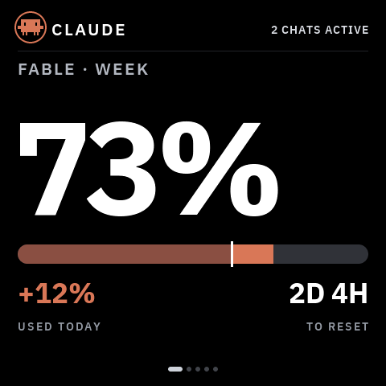
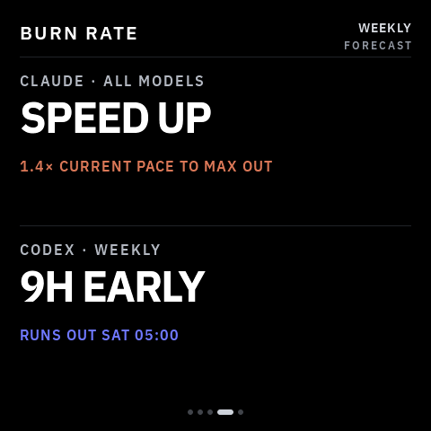

# VibePulse

A little always-on screen for your shelf that shows what your AI agents are
up to — **Claude Code and Codex usage, live agent activity, and a full-screen
heads-up when an agent is waiting for you.**

| | | |
|---|---|---|
|  |  |  |

*Exact 480×480 frames — the simulator renders the same pixels as the panel.*

**How it works:** a tiny Python service on your Mac reads your local Claude
Code / Codex logs and rate-limit headers and serves plain numbers over your
LAN. The screen polls it every 30 seconds. No cloud, no accounts, no API
keys on the device, nothing leaves your network.

## What you need

- **[Waveshare ESP32-S3-Touch-AMOLED-2.16](https://www.waveshare.com/esp32-s3-touch-amoled-2.16.htm)**
  (~$30) — no soldering, just a USB-C cable. (Same board Clawdmeter uses —
  already own one? You're 10 minutes away.)
- **A Mac** on the same WiFi (the log-reading service is macOS-only for now)
- **Claude Code and/or Codex** — either alone is fine. Missing data shows as
  dashes, never as made-up numbers.
- **2.4 GHz WiFi** — the ESP32-S3 can't see 5 GHz networks.

## Setup, the vibecoder way

Clone the repo, open Claude Code or Codex inside it, and say:

> Set up VibePulse for me: help me fill in secrets.h, build and flash the
> board over USB, and start the tokenserver on this Mac.

The repo ships with `CLAUDE.md` / `AGENTS.md`, so your agent already knows
its way around. That's the whole onboarding.

## Setup, the manual way

1. Install [ESP-IDF 5.5](https://docs.espressif.com/projects/esp-idf/en/stable/esp32s3/get-started/index.html)
   and `brew install cmake ninja`
2. Clone this repo, then:

   ```
   cp secrets.h.example secrets.h   # fill in WiFi + your Mac's hostname (2 min)
   . ~/esp/esp-idf/export.sh
   idf.py set-target esp32s3
   idf.py build
   idf.py -p /dev/cu.usbmodem101 flash
   ```

   Board not showing up under `/dev/cu.usbmodem*`? Hold **BOOT**, tap
   **RESET**, release **BOOT** — it re-enumerates in download mode.
3. Start the service on your Mac — pure Python stdlib, nothing to install:

   ```
   python3 tools/tokenserver/tokenserver.py
   ```

   Autostart on login: see [tools/tokenserver/README.md](tools/tokenserver/README.md).

## No hardware? Run the simulator

```
brew install sdl2 cmake ninja
cmake -S sim -B sim/build -G Ninja && ninja -C sim/build
./sim/build/torget-sim
```

Same code, same fonts, same pixels as the device. Every screenshot above is
a simulator frame.

## What's on screen

- **Usage** — Claude 5-hour session, weekly and heaviest-model-weekly quota,
  Codex weekly quota; each with reset countdown and "+N% used today".
- **Live agent monitor** — which agents are working right now (model,
  effort, project), and a full-screen **NEEDS YOU** when one is blocked
  waiting for your input. Tap to dismiss.
- **Burn rate** — a forecast per provider: on pace, running out early (and
  when), or how much head-room is left at reset.

## Privacy

- Everything stays on your LAN; the screen only ever receives percentages
  and counts.
- No prompts, no code, no commands, no file contents are stored or served.
  The service keeps only content-free quota points (at most one per 15
  minutes, kept 8 days) for the trends.
- Your OAuth token never leaves the Mac.
- A lost or stolen screen leaks exactly one thing: your WiFi password —
  which you rotate in your router, not in any cloud.

## Tweak it

VibePulse is an app on **Torget**, a deliberately small LVGL 9 app platform
for this panel. An app is one component exporting
`torget_app_t { name, icon, create, enter, leave }`; the platform owns WiFi,
the panel, brightness and the launcher. Repo map:

```
platform/            app contract + launcher + fonts (IBM Plex)
main/                ESP32 host layer: boot, WiFi, SNTP, app registry
components/app_*     the apps — VibePulse lives in app_tokens/
tools/tokenserver/   the Mac service (Python stdlib)
sim/                 SDL simulator — the whole platform on your Mac
test/                host tests, run with ./test/run.sh (no ESP-IDF needed)
spec/                hardware truth + UI design system
```

Design rules: true black background, IBM Plex, dashes instead of invented
zeros. The deeper docs (architecture, writing an app, hardware traps) are in
[README.sv.md](README.sv.md) — in Swedish, because this started as a Swedish
hobby project. Your agent reads Swedish just fine.

## FAQ

- **Windows/Linux for the Mac service?** Not yet — contributions welcome.
- **Other boards/sizes?** Not yet; the platform is pinned to this exact
  panel so that one pixel-perfect build stays pixel-perfect.
- **Just Claude, no Codex (or vice versa)?** Works. The other half shows
  dashes.

## License

MIT © Niclas Vestlund
