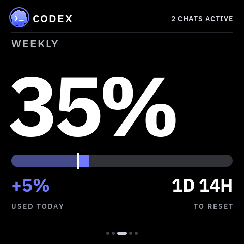
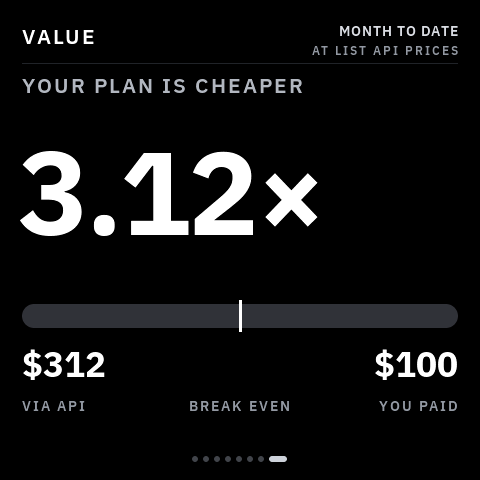
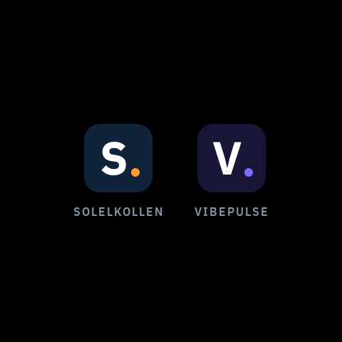

# VibePulse

[](https://github.com/niclasvestlund-YT/vibepulse/actions/workflows/ci.yml)


**A little always-on screen for your shelf that shows what your AI coding
agents are doing — and taps you on the shoulder when one is stuck waiting
for you.**

Claude Code and Codex usage, live agent activity, and a full-screen
**NEEDS YOU** alert. A ~$30 ESP32-S3 panel plus a pure-stdlib Python service
on your Mac. No cloud, no accounts, no API keys on the device. Agent data
never leaves your LAN; the optional public-repository module makes only
anonymous GitHub API reads from the Mac.

## The problem

When you run coding agents all day, two things are invisible:

- **How much quota is left.** You usually find out you're at the wall when a
  long task dies halfway through — not before you start it.
- **When an agent stopped.** It asks one yes/no question and then just sits
  there. You're in another window. Sometimes for twenty minutes.

Both answers already exist, buried in a terminal you're not looking at.
VibePulse moves them onto a screen you can't miss: one glance from across
the room, no window to switch to, no menu bar to squint at.

> **Status:** work in progress. This is an ongoing project for me and plenty
> of tweaks are still on the list, but enough people asked about it that I'm
> opening it up now rather than when it feels "done". Expect rough edges and
> frequent commits.

## What's on screen

Six core pages, swipe or auto-rotate, plus the always-present value-multiple
page (it shows the dollar total once agents log priced usage, but the
multiple itself stays dashed — `SET YOUR PLAN COST` — until you pick a named
plan tier or state your exact cost) and an optional, compile-time-gated
GitHub project pulse. Every image below is an exact 480×480 frame — the
simulator renders
the same pixels as the panel.

<table>
<tr>
<td width="50%"></td>
<td valign="top">

**Usage** — Claude's weekly and heaviest-model-weekly quota, plus Codex's
weekly quota. Each with a reset countdown and how much you've burned today.

</td>
</tr>
<tr>
<td></td>
<td valign="top">

**NEEDS YOU** — when an agent blocks on your input, the whole screen turns
into the alert, in that provider's colour, naming the project it's waiting
on. Tap to dismiss.

</td>
</tr>
<tr>
<td></td>
<td valign="top">

**Live agent monitor** — the header shows which agents are working right
now, with model and effort, on every page. `2 CHATS ACTIVE` when several
are running.

</td>
</tr>
<tr>
<td></td>
<td valign="top">

**Burn rate** — a forecast per provider: on pace, running out early (and
when), or how much head-room is left at reset.

</td>
</tr>
<tr>
<td></td>
<td valign="top">

**Max Tracker** — a GitHub-style heatmap of your daily quota peaks, with
coding streaks and max counters, per provider. Red cells are days you
maxed out.

</td>
</tr>
</table>

Both providers get equal treatment — same pages, same alert, their own
accent colour:

**Codex weekly quota**



**Codex NEEDS YOU alert**


**Claude Max Tracker**


### Optional GitHub project pulse

One public `owner/repository` can add a deliberately sparse seventh page:
the current star count is the hero and forks are the only secondary metric.
The same raster covers every data provenance, so the glass never lies about
freshness:

**Live**


**Cached / stale**


**Waiting (no data)**


The page and star moments are independent switches. A new star can therefore
briefly take over the current VibePulse view even when the GitHub page is not
in rotation. It covers the previous page with a quiet black stage, shows a
large filled star, the repository, the stargazer when GitHub supplies one,
the new total, and `TAP TO DISMISS`; otherwise it returns to the exact
previous page after two minutes.


The Mac service polls GitHub's public API and republishes a small, validated
LAN payload. The ESP32 never talks to GitHub, and a GitHub timeout or rate
limit cannot stall the Claude/Codex endpoints. Configure it with:

```
python3 tools/tokenserver/tokenserver.py --github-repo owner/repository
```

Then opt into `TK_GITHUB_SCREEN_ENABLED` and/or
`TK_GITHUB_NOTIFICATIONS_ENABLED` in your gitignored `secrets.h`. Both are
off by default. No GitHub token is required for a public repository.

`TK_GITHUB_SOUND_ENABLED` is a separate default-off gate for the 258 ms
A5-to-C#6 chime. The sequence and failure-isolated playback contract are in
place, but the current target intentionally registers no codec backend until
the physical speaker and display-DMA budget have passed device testing. A
missing or failed sound backend never delays the popup or any network path.

### It never makes numbers up

<table>
<tr>
<td width="35%"></td>
<td valign="top">

Before the first successful fetch, and whenever a source is missing, you get
dashes — never a placeholder `0%` that you might believe. If the service
goes away, the last good numbers stay on screen and get marked stale rather
than silently drifting.

Run Claude only, or Codex only, and the other half simply shows dashes.

</td>
</tr>
</table>

### Are you getting your money's worth?

<table>
<tr>
<td width="35%"></td>
<td valign="top">

The usage pages answer *how much have I spent?*. The
[**value multiple**](docs/value-multiple.md) answers the question you
actually have every month: it prices the tokens your agents already logged
at list API rates and divides by what you pay. It's its own page on the
swipeable strip, alongside GitHub — neither replaces the other.

</td>
</tr>
</table>

```
python3 tools/tokenserver/tokenserver.py --claude-plan max5x --plan-cost-usd 100
```

It counts cache tokens, which is the whole point — a real record here reads
2 input and 4 output against 23 655 cache-read, so pricing only input and
output understates it by 577x.

Rates are not hand-maintained: they are generated from a public price
catalogue by `tools/tokenserver/update_prices.py` and committed, so the
server stays offline and refreshing is one command. An unknown model degrades
the figure to a dash rather than being silently free.

## How it works

```
        your Mac                             your shelf
┌────────────────────────────┐          ┌──────────────┐
│ ~/.claude/projects/*.jsonl │          │              │
│ ~/.codex/sessions/*.jsonl  │ ───────► │   ESP32-S3   │
│ rate-limit headers         │          │    AMOLED    │
└────────────────────────────┘          └──────────────┘
     tokenserver.py :8737           plain JSON over your LAN,
     pure Python stdlib                polled every 30 s
```

A tiny Python service on your Mac reads your local Claude Code / Codex logs
and rate-limit headers, and serves plain numbers over your LAN. The screen
polls it every 30 seconds. Your OAuth token never leaves the Mac; the screen
only ever receives percentages, counts and coarse status.

## What you need

- **[Waveshare ESP32-S3-Touch-AMOLED-2.16](https://www.waveshare.com/esp32-s3-touch-amoled-2.16.htm)**
  (~$30). No soldering, just a USB-C cable. It's the same board Clawdmeter
  uses, so if you already own one you're 10 minutes away.
- **A Mac** on the same WiFi (the log-reading service is macOS-only for now)
- **Claude Code and/or Codex.** Either alone is fine.
- **2.4 GHz WiFi.** The ESP32-S3 can't see 5 GHz networks.

## Setup, the vibecoder way

Clone the repo, open your coding agent inside it (Claude Code, Codex,
Cursor, whatever you run), and say:

> Set up VibePulse for me: help me fill in secrets.h, build and flash the
> board over USB, and start the tokenserver on this Mac.

The repo is built for this. `CLAUDE.md` and `AGENTS.md` point your agent
straight at **[docs/agent-setup.md](docs/agent-setup.md)** — an English
runbook written for agents, with a verification after every step, the traps
that actually cost people an evening, and a symptom→fix table. That's the
whole onboarding.

Reading rather than running? That runbook is also the fastest way to
understand how the pieces fit together.

## Setup, the manual way

1. Install [ESP-IDF 5.5](https://docs.espressif.com/projects/esp-idf/en/stable/esp32s3/get-started/index.html)
   and `brew install cmake ninja`
2. Clone this repo, then:

   ```
   cp secrets.h.example secrets.h   # fill in WiFi + your Mac's hostname (2 min)
   . ~/esp/esp-idf/export.sh
   idf.py set-target esp32s3
   idf.py build
   idf.py -p /dev/cu.usbmodem101 flash
   ```

   **Don't miss this:** in `secrets.h`, point the `TK_VIBEPULSE_BASE_URL`
   block at your Mac by replacing the `DIN-MAC` placeholder. Those URLs ship
   active on purpose — a wrong hostname is visible in the log, whereas an
   undefined URL compiles the fetch out entirely and the screen boots fine
   and shows dashes forever. Use your Mac's Bonjour name
   (`scutil --get LocalHostName`) rather than an IP, so the same firmware
   works on your home network and on a phone hotspot.

   Board not showing up under `/dev/cu.usbmodem*`? Hold **BOOT**, tap
   **RESET**, release **BOOT** and it re-enumerates in download mode.

   **Power matters:** flash with the board in download mode (screen dark).
   A computer USB port often cannot feed the running firmware. The AMOLED
   panel's draw makes the board bounce off the bus or hang, which looks
   like a flaky cable. After flashing, run the screen from its own USB
   power supply, not your computer.
3. Start the service on your Mac. Pure Python stdlib, nothing to install:

   ```
   python3 tools/tokenserver/tokenserver.py
   ```

   Autostart on login: see [tools/tokenserver/README.md](tools/tokenserver/README.md).

## Over-the-air updates

After the first USB flash, the screen updates itself over WiFi. The consent
chain is deliberate and three-factor: a **physical 3-second hold on KEY3**
opens a ten-minute maintenance window (the glass shows an UPDATES ON ring
with the lease draining clockwise), a **64-hex token** from `secrets.h`
authenticates the upload, and the window **closes itself** — a short KEY3
press closes it early. No button, no update; a script can never open the
window for you.

```
idf.py build
tools/ota-flash.sh <device-ip>     # waits for your KEY3 hold, then uploads
```

The device verifies the image (magic, chip, project, SHA-256), writes it to
the **inactive A/B slot** (`ota_0`/`ota_1`, 5 MB each — see
`partitions.csv`), reboots into it, and a **boot-health gate** must approve
the new image within 15 seconds — display, UI, scheduler, NVS and memory
proofs — or the bootloader rolls back to the previous slot automatically.
USB-C remains the rescue path and is never written by an OTA. After an OTA
reboot the window re-arms itself once, so a build-test-build session needs
one hold, not one per build.

The tokenserver announces the newest build on your Mac
(`otaAvailableVersion` on `/api/tokens`); when the screen runs an older
version it takes the glass with an **UPDATE READY** notice — hold KEY3 to
receive — or answer the on-glass LATER/UPDATE pills by touch; tapping
UPDATE opens the window just like the hold does. A snooze returns every
hour until installed. Full lifecycle reference: [docs/ota.md](docs/ota.md).

**If someone tells you "this project has no OTA":** they are reading a tree
where `partitions.csv` still has a single `factory` partition. The OTA
foundation replaced that table (A/B slots + `otadata`) — check the branch
you are on before concluding anything, and never assume the flash layout
without reading `partitions.csv` in the checkout you are actually building.

## No hardware? Run the simulator

```
brew install sdl2 cmake ninja
cmake -S sim -B sim/build -G Ninja && ninja -C sim/build
./sim/build/torget-sim
```

(On Debian/Ubuntu: `apt-get install libsdl2-dev cmake ninja-build` instead.)

Same code, same fonts, same pixels as the device — it builds the real
platform and VibePulse against the real LVGL, and feeds it the recorded
fixtures in `sim-fixtures/` through the same parsers the board runs. Every
device screenshot in this README is an unmodified simulator frame (the
banner just places three of them side by side), and the physical panel was
reviewed against them ([review](docs/superpowers/reviews/2026-08-13-max-tracker-physical-static.md)).

Keys: `[` / `]` change VibePulse page, `S` cycles agent status, `M` cycles
Max Tracker fixtures, `T` re-feeds tokens, `G` simulates a new GitHub star,
`L` opens the launcher.

## Privacy

- Agent activity and usage stay on your LAN; the screen only ever receives
  percentages, counts and coarse status — a project name, a model, an effort
  level.
- No prompts, no code, no commands, no file contents are stored or served.
  The service keeps only content-free quota points (at most one per 15
  minutes, kept 8 days) for the trends.
- Your OAuth token never leaves the Mac.
- If the optional GitHub module is enabled, the Mac anonymously reads only
  public repository and stargazer metadata from GitHub. The ESP32 still
  talks only to the Mac over your LAN.
- A lost or stolen screen leaks your WiFi credentials and the LAN hostname
  of your Mac — both of which you rotate yourself, not in any cloud.

## Tweak it

<table>
<tr>
<td width="30%"></td>
<td valign="top">

VibePulse is an app on **Torget**, a deliberately small LVGL 9 app platform
for this panel. An app is one component exporting
`torget_app_t { name, icon, create, enter, leave }`; the platform owns WiFi,
the panel, brightness and the launcher.

This repo ships exactly one app, so that's all you get on the screen — one
binary, one thing, nothing to wonder about. The platform can hold several
apps at once (that's what the launcher is for), but any others live in their
own repos and are only built in if you check them out.

</td>
</tr>
</table>

Design rules: true black background, IBM Plex, dashes instead of invented
zeros, and provider accents locked to Claude `#D97757` and Codex `#6F78FF`.

```
platform/            app contract + launcher + fonts (IBM Plex)
main/                ESP32 host layer: boot, WiFi, SNTP, app registry
components/app_*     the app (VibePulse lives in app_tokens/)
tools/tokenserver/   the Mac service (Python stdlib)
sim/                 SDL simulator, the whole platform on your Mac
test/                host tests, run with ./test/run.sh (no ESP-IDF needed)
spec/                hardware truth + UI design system
```

The deeper docs (architecture, writing an app, hardware traps) are in
[README.sv.md](README.sv.md), in Swedish, because this started as a Swedish
hobby project. Your agent reads Swedish just fine.

## Hardware knowledge

Hardware truth — capabilities, sources and which claims are verified on a
real unit — lives in the validated registries under `spec/`. Read
`spec/hardware.md` before any hardware-dependent work, and don't promote a
capability to "verified" without a physical check.

`./test/run.sh` is the host gate that enforces those registries, alongside
the C core tests and the Python suites. No ESP-IDF required, but it does
need a reproducible Python:

```sh
python3.12 -m venv .venv
. .venv/bin/activate
python -m pip install -r requirements-dev.txt
./test/run.sh
```

Python 3.11+ is required. The script uses the activated environment's Python
by default; set `PYTHON_BIN` to point at a different 3.11+ interpreter.

## FAQ

- **Windows or Linux for the Mac service?** Not yet — the log paths and
  keychain reads are macOS-specific. Tracked in
  [#3 (Windows)](https://github.com/niclasvestlund-YT/vibepulse/issues/3)
  and [#2 (Linux)](https://github.com/niclasvestlund-YT/vibepulse/issues/2);
  contributions very welcome.
- **Other boards or panel sizes?** Not yet. The platform is pinned to this
  exact panel so one pixel-perfect build stays pixel-perfect, but a port is
  a contained job (BSP, layout constants, fonts) —
  [#5](https://github.com/niclasvestlund-YT/vibepulse/issues/5).
- **Cursor, Gemini CLI, other providers?** Not yet —
  [#4](https://github.com/niclasvestlund-YT/vibepulse/issues/4).
- **Just Claude, no Codex (or vice versa)?** Works. The other half shows
  dashes.
- **Does it need internet?** No. The board talks to one host on your LAN.

## License

MIT © Niclas Vestlund

The "Claude" and "Codex" names and icons belong to Anthropic and OpenAI.
They appear here only to identify which provider a number belongs to, they
are not covered by the MIT license, and they will be removed on request.
The IBM Plex fonts are used under the SIL Open Font License
([platform/fonts/LICENSE-OFL.txt](platform/fonts/LICENSE-OFL.txt)).

This is my first open source release. Issues and PRs are very welcome, and
if VibePulse ends up on your shelf, a ⭐ helps others find it.

Built by [Niclas Vestlund](https://niclasvestlund.se).
