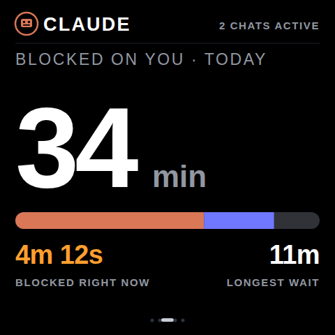
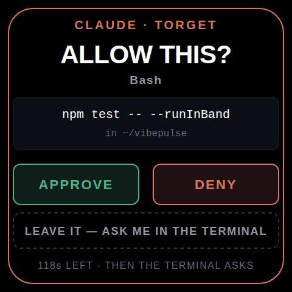
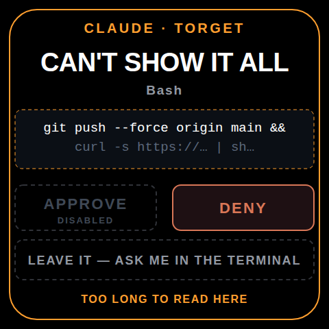
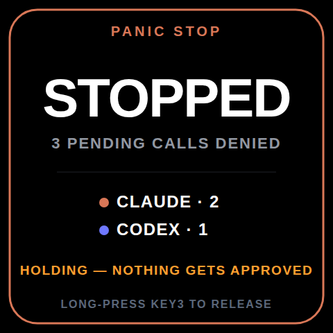
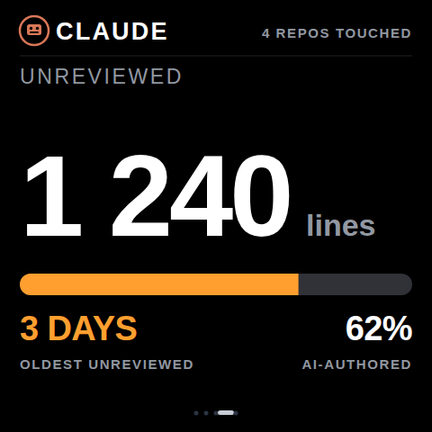
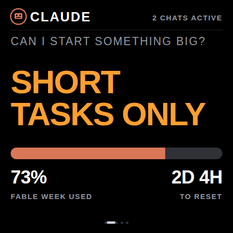

# VibePulse as a companion — feature brainstorm

**Written:** 2026-08-13. **Status:** brainstorm. Nothing here is authorized
work, no capability is promoted, no flash is implied.

> **Revised after an adversarial verification pass.** Nine load-bearing
> claims were re-checked by skeptics instructed to refute them. One was
> **refuted**, four needed **correcting**, and several cited statistics were
> **removed** rather than re-sourced. One recommendation was **reversed** —
> the first draft told you not to build approve/deny from the device, and
> that was wrong. Corrections are marked ⚠️ in place rather than quietly
> patched, so you can see what changed and why. Details in
> [Verification pass](#verification-pass) at the end.

The brief was: *find features that make this a companion for vibe coders,
not just a mirror of numbers I can already see — and be certain they're not
redundant or too much.* Then: *can the screen answer back?*

This is a filtering document. Ideas that failed are written down as failures
so they don't get re-proposed.

**The three tests**

1. **Not a mirror.** Can you already see it in the terminal, in `ccusage`, or
   in a menu-bar app?
2. **Glanceable.** Does it survive being one dominant thing at 480 x 480,
   read from three metres? `ui-spec.md`: *"En ny informationsrad på skärmen
   är ett regelbrott."*
3. **Honest.** Buildable without inventing a number, with a label that says
   what the number actually measures.

---

## Vad du faktiskt skulle se på skärmen

Sex konceptmockups, exakt 480 × 480, mot paletten i
`design/vibepulse/studio-design.json` och hero-geometrin läst ur de riktiga
rastren i `docs/img/`. Läs den här sektionen först — resten av dokumentet är
motiveringen bakom bilderna.

> ⚠️ **Konceptbilder.** Inte Studio-captures, inte godkänd design, inget
> fysiskt granskat, ingen flash implicerad. De visar avsikt, inte en LVGL-port.
> Regenereras med `python3 tools/mockups/gen_concept_mockups.py`.

### 1. Väntetidsmätaren — den bärande idén



Ett dominant tal, precis som kvotsidorna. Stapeln visar hur väntetiden delades
mellan Claude och Codex. Sekundärraden ger det du faktiskt vill veta i stunden:
**blockerad just nu** och längsta väntan idag. Etiketten säger vad talet mäter.

### 2. Godkännande från enheten



Hela kommandot, i mono, plus katalogen. Tre val, inte två: **LEAVE IT** lämnar
beslutet till terminalen istället för att tvinga ett ja/nej. Nedräkningen säger
vad som händer om du inte gör något — inget godkänns av tystnad.

### 3. När kommandot inte går att visa



Det här är hela ärlighetsprincipen applicerad på en knapp. Får kommandot inte
plats visas det trunkerat och **APPROVE renderas men är död**. DENY funkar
alltid. Du får aldrig godkänna text du inte kan läsa.

### 4. Panikstopp



Billigast i hela dokumentet och bäst formad: den kan bara **neka**. Ingen
allowlist, ingen förtroendemodell, ingen privacy-uppluckring — att neka avslöjar
inget. Värsta en främling kan göra är att stoppa ditt arbete.

### 5. Review debt



En **fyllnadsnivå, inte ett procenttal** — det finns ingen ärlig nämnare för
"hur mycket ogranskad kod är för mycket". Åldern på den äldsta är den siffra som
faktiskt får dig att agera.

### 6. Go / no-go istället för prognos



Samma data som burn-rate-sidan, men **ett beslut istället för ett tal**. Den
enda sortens ändring UI-specen välkomnar: den tar bort en siffra istället för
att lägga till en. Måste falla tillbaka till ett streck när prognosen är
`collecting`.

---

## Besluten i korthet

| Bygg | Bygg inte |
|---|---|
| Panikstopp (först — bara nekar) | Fler token-, kostnads- eller kvotfönster |
| Väntetidsmätaren | OpenTelemetry som *tvärleverantörs*-limmet |
| Godkänn/neka från enheten *(omvänt beslut)* | Lovable |
| Review debt | Ljud och haptik, för nu |
| Go / no-go | Trust rate som huvudmetrik |
| Fragmentering / WIP | |

Ordningen finns längst ner. Resten av dokumentet är varför — inklusive vad som
inte höll när påståendena granskades.

---

## The uncomfortable finding, first

Between May and August 2026 the "agent numbers on a small screen" lane went
from empty to crowded. This matters more than any individual feature idea,
so it goes first.

The three headline competitors below were adversarially re-verified after
this document's first draft, and all three needed correcting. The Clawdmeter
and "various" rows were **not** re-verified — see the note after the table,
because the Clawdmeter row turns out to matter more than any of them.

| Who | Real status | Overlap |
|---|---|---|
| **[Token Monitor](https://tokenmonitor.dev/)** (Fractal Manifold) | **A live Kickstarter campaign since ~7 Aug 2026, not a shipping product.** Goal €25 000, first units estimated Nov 2026, funding outcome unverified. €99 is the Super Early Bird tier — first 50 backers, ex shipping and tax; standard Early Bird is €120. | 4-inch 480×480 **IPS** (*not* AMOLED): quota, session limits, token counts, reset timers, estimated cost. Local Apache-2.0 broker written in Go. Its broker's device registry documents Claude Code, Codex CLI and **Gemini** CLI — Antigravity appears in marketing copy but not in the repo. |
| **[Clawdmeter](https://www.hackster.io/news/keep-tabs-on-claude-with-the-cute-animated-clawdmeter-744383d44094)** | **Shipped**, and per this repo's own README it uses the **same Waveshare AMOLED board** | Animated mascot, session + weekly. Claude-only. The original inspiration — and the row that matters most for the argument below. |
| **[anthropics/claude-desktop-buddy](https://github.com/anthropics/claude-desktop-buddy)** | Real Anthropic-owned repo (MIT, "Copyright 2026 Anthropic, PBC", ~2.5 k stars) — but Anthropic states it **"isn't an officially supported product feature"**, and it needs Developer Mode. | BLE over Nordic UART Service. The M5StickC Plus reference firmware is genuinely bidirectional: a pending permission puts the pet in an `attention` state; button A sends `{"cmd":"permission",…,"decision":"once"}`, button B denies. |
| **[AgentDeck](https://github.com/puritysb/AgentDeck)** | Real and active (~194 stars, 26 surfaces exactly) | Per-session keys, working/waiting/idle, "which agent is waiting on you". **But** YES/NO/ALWAYS, STOP and mode cycling work only from its *interactive* surfaces and only for PTY-managed sessions. **Hook-observed sessions are display-only, and every shipping ESP32 board is output-only apart from touch** (exceptions: a T-Embed knob and a 10.1-inch touch model). |
| AgentMeter, Hermes Meter, ClaudeGauge, m5stack-claude-code-buddy | Various | Usage and alerting |

Plus, on the software side, `ccusage` covers **16 agent sources** for tokens
and cost; `claude-monitor` has done burn-rate depletion prediction in a rich
TUI since 2025; there are at least five macOS menu-bar apps doing 5-hour +
weekly + Opus-week; and there are Grafana dashboards for Claude Code on
grafana.com. (⚠️ An earlier draft called those "official". Verification only
established that community dashboards exist — don't cut scope on the strength
of a word you can't support.)

⚠️ **Sourcing:** tokenmonitor.dev, Kickstarter, cnx-software and hackster are
all blocked by this session's egress proxy, so Token Monitor's specs and
pricing are second-hand from search summaries. Its GitHub facts, and
everything about claude-desktop-buddy and AgentDeck, come from the
repositories themselves.

**Read it honestly, with the corrections applied:** the direction holds —
this is no longer an empty niche, and Usage and Burn Rate are table stakes
*as ideas*.

⚠️ **And a self-contradiction worth killing rather than hiding.** A middle
draft tried to rescue the situation by saying "the nearest competitor hasn't
shipped, and isn't on the identical panel." That argument is refuted by the
Clawdmeter row two lines above it: Clawdmeter **has** shipped and **is** on
the same Waveshare AMOLED board. The IPS-versus-AMOLED distinction is a real
correction about *Token Monitor specifically* — but it does not generalise
into "AMOLED is a differentiator", because the shipped competitor already
has the same glass. Two rows of that table were also never adversarially
re-verified (Clawdmeter and the short "various" row), so the line claiming
every row was is itself too strong.

The honest version: **the panel is not the moat and neither is the quota
page.** What remains defensible is what the device *does* with the panel —
which is the argument the rest of this document has to carry on its own.

The good news is that the crowd is all standing in the same place. **Every
one of these tools shows you what you are *spending*. None of them puts what
agent-driven work is *costing* you in front of you.**

⚠️ Stated that carefully on purpose. An earlier draft said "not one
*measures* it", which is false and is contradicted later in this document —
Claude Code itself measures the biggest piece of it (see the human-latency
meter). The defensible claim is about **surfacing**, not measurement, and
that distinction runs through the rest of this document.

---

## The reframe

VibePulse today is a **status mirror**: it shows quota, it shows agent state.
Both real, both useful, both available elsewhere. The value it adds is
*placement*, not information — and placement alone is what earned The Verge's
August 2022 Tidbyt review its headline: *"a fun desk accessory in need of a
purpose"*. (A headline, not a line from the review body — the reviewer also
called it "an excellent delivery system for quick bits of ambient
information", which is exactly the needle this document is trying to thread.)

A device earns its shelf space when it shows something **you would never open
a dashboard to see**. That's the test, and it's a sharp one:

- *Quota* fails it. You'd check quota anyway; the menu bar already tells you.
- *"How long have my agents been waiting on me today"* passes it hard.
  Nobody would open a dashboard for that, and it's exactly what you can't see
  from where you're sitting.

So the thesis: **VibePulse should become the only device that shows what
agent-driven work is costing you** — your waiting time, your unreviewed
backlog, your fragmentation, your hours. That is defensible against Token
Monitor and against Anthropic's own BLE buddy, because neither can follow it
there without becoming a different product.

Three verbs organise everything below.

| | |
|---|---|
| **Act** | The screen becomes an input device. You answer from the kitchen. |
| **Remember** | The terminal shows *now*, per window. The screen shows *across all sessions, across days*. |
| **Protect** | Warn before the wall, catch the agent flailing, give you a physical stop. |

---

## Can the screen answer back? Yes — and it's supported, not a research project

This was the strongest idea in the brief, and the answer is better than
expected. **Do not build terminal keystroke injection.** There is a
supported, structured path.

### The mechanism

Both Claude Code **and** Codex ship a **`PermissionRequest` hook** that fires
exactly when the agent is about to ask you, **blocks** for up to 600 seconds
by default, and takes a structured verdict.

Claude Code's `http` hook type means **the tokenserver can receive the
request and return the verdict with no shell script at all**:

```json
{
  "hooks": {
    "PermissionRequest": [{
      "matcher": ".*",
      "hooks": [{
        "type": "http",
        "url": "http://127.0.0.1:8737/api/approval",
        "timeout": 120,
        "statusMessage": "Waiting for VibePulse…",
        "headers": { "Authorization": "Bearer $VIBEPULSE_TOKEN" },
        "allowedEnvVars": ["VIBEPULSE_TOKEN"]
      }]
    }]
  }
}
```

⚠️ **Two gates that will otherwise cost an evening**, both confirmed in the
shipped binary:

- **`allowedHttpHookUrls`** — described in-binary as an *"Allowlist of URL
  patterns that HTTP hooks may target"*, with the runtime refusal
  `HTTP hook blocked: <url> does not match any pattern in
  allowedHttpHookUrls`. On a managed or enterprise-configured Mac, the whole
  Act feature silently never fires and the setup gives no clue why. There is
  also an `allowManagedPermissionRulesOnly` setting that can force managed
  hooks only, ignoring user, project and local hooks entirely.
- **Address restriction.** The binary also carries
  `HTTP hook blocked: <url> resolves to … (private/link-local address).
  Loopback (127.0…` — so the hook URL should stay on **loopback**, exactly
  as in the snippet above. This is not a limitation for this design: the
  *hook* talks to the tokenserver on `127.0.0.1`, and the *device* talks to
  it over the LAN on a separate listener. But pointing the hook at the Mac's
  LAN address instead would be blocked.

Claude Code POSTs the event and parses the **response body**. The server
holds the connection open until the device taps. `tokenserver.py:1604`
already uses `ThreadingHTTPServer`, so concurrent held requests work today
without a rewrite. As a bonus the TUI spinner literally reads
"Waiting for VibePulse…" while you walk to the kitchen.

**What you receive** — everything needed to render a decision:

```json
{
  "session_id": "abc123",
  "cwd": "/Users/…/Torget",
  "permission_mode": "default",
  "hook_event_name": "PermissionRequest",
  "tool_name": "Bash",
  "tool_input": { "command": "rm -rf node_modules",
                  "description": "Remove node_modules directory" },
  "permission_suggestions": [ … ]
}
```

`permission_suggestions` carries the literal "always allow" options the TUI
would have offered — which is how a "YES, AND DON'T ASK AGAIN" button
behaves identically to picking it in the terminal.

**What you return** — note this carefully, because a summary of the docs
gets it wrong. `decision` is an **object** discriminated on `behavior`, not a
string, and there is no `escalate` value (verified against the shipped
v2.1.231 binary schema):

```json
{"hookSpecificOutput":{"hookEventName":"PermissionRequest",
 "decision":{"behavior":"allow"}}}
```
```json
{"hookSpecificOutput":{"hookEventName":"PermissionRequest",
 "decision":{"behavior":"deny","message":"Denied from VibePulse"}}}
```

Emitting **no** `decision` (exit 0, empty stdout) leaves the flow unchanged
and the normal terminal prompt renders.

### Three properties that make this correct rather than merely possible

**1. Timeout is fail-safe.** A `PermissionRequest` hook that hits its timeout
is cancelled, its output discarded, and **no decision is rendered** — so the
normal interactive prompt appears and the human decides with full context.
Nothing is ever approved by silence. (`PreToolUse` does *not* have this
property; the docs warn explicitly that a timed-out `PreToolUse` hook does
**not** block the tool call. This is the main reason to prefer
`PermissionRequest`.)

**2. The held connection *is* the pending approval.** This dissolves the
staleness race structurally rather than probabilistically. Neither provider
puts a stable id in the payload — `PermissionRequest` notably has **no
`tool_use_id`** — so the server mints `request_id = uuid4()` on receipt and
parks the connection. The device echoes `request_id` back with its tap.
Present → resolve that exact connection and delete it. Absent → reject the
tap, because it was already answered, timed out, or superseded. **There is no
code path where a tap lands on a different prompt than the one it named.**
Idempotency on flaky WiFi comes free from delete-on-resolve.

**3. There is never a double-offer.** `PermissionRequest` fires *before* the
TUI prompt renders. While the device holds the decision the terminal shows
the spinner, not a half-answered prompt. This is precisely the property
`tmux send-keys` can never have.

### Why not the alternatives

- **`Notification` hook** — cannot block by design, and its
  `permission_prompt` type fires only after ~6 seconds without terminal
  input, with each keystroke deferring it. Good for *"finished, come look"*
  (`idle_prompt`), wrong for answering.
- **`tmux send-keys` / `osascript`** — read-then-act is not atomic, so
  between `capture-pane` and the keystroke the prompt can be answered,
  cancelled, or **replaced by a different one**; `2` might mean "No" on the
  prompt you saw and "Yes, always" on the one that replaced it. It also means
  regex-scraping a TUI whose option ordering is not an API. `osascript` adds
  two separate macOS TCC grants and steals window focus. Close this door.
- **Agent SDK `canUseTool`** — the most capable API (unbounded `await`), the
  worst product fit: it replaces the interactive TUI the user wants to keep.
- **`--permission-prompt-tool`** — non-interactive mode only. Dead end here.

### Safety: the kitchen problem

A physical YES button in a kitchen is a security surface, and the easy threat
is a passing housemate. The harder threat is **you**, tapping YES on a
truncated command while holding a coffee.

**The single strongest mitigation is free and does not live in your code.**
Deny and ask rules are still evaluated, so *a hook returning `allow` cannot
override a matching deny rule.* Putting `Bash(rm -rf *)`, `Bash(sudo *)`,
`Bash(curl * | sh)`, `Write(**/.env)` and `Bash(git push --force *)` in
`permissions.deny` means the device **physically cannot** approve them —
regardless of a bug in the service, a compromised screen, or a hostile LAN
peer. Design so the worst-case authority is bounded by a file, not by your
own code being correct.

Then, in order of value:

1. **Allowlist what's even routable** via the hook's `if` field, so only
   low-risk classes reach the device and everything else falls through to
   the terminal. Treat this as noise reduction, **not** the boundary — the
   docs note `if` is best-effort and *fails open* on unparseable Bash.
2. **Asymmetric buttons.** DENY for anything; APPROVE only for allowlisted
   tools. A deny-only device is still enormously useful and has near-zero
   blast radius.
3. **Show the whole command or don't offer YES.** If it doesn't fit at
   480×480, render it truncated and **disable APPROVE**. Never let anyone
   approve text they cannot see. This is the honesty invariant applied to a
   button, and it's the mitigation most likely to be skipped.
4. **Authenticate the device.** The hook's `Authorization` header
   authenticates *Claude → server*. You separately need *device → server*
   auth: a shared secret in `secrets.h`, HMAC over `(request_id, verdict)`,
   and **bind to the LAN interface instead of `0.0.0.0`**.
5. **Freshness** — reject taps older than ~90 s, and show the age.
6. **Log every verdict** (request id, tool, full command, timestamp). When
   something goes wrong you need to answer "did the shelf do that?"

> ### The blast-radius change, stated plainly
>
> Today the server is `ThreadingHTTPServer` on **`0.0.0.0:8737` with no
> authentication**, and one `do_GET` at `tokenserver.py:1494`. That is
> defensible: the worst case is a LAN neighbour learning your quota
> percentages. **The moment a POST can approve a tool call, the worst case
> becomes a LAN neighbour approving `rm -rf` in your agent.** Auth is not a
> polish item here, it ships with the feature or the feature doesn't ship.

### The privacy tension — decide it deliberately

The current contract is hard: *no prompts, no commands, no message text ever
leave the Mac.* Showing "allow `rm -rf build/`?" **breaks that**, because the
command is exactly what you need in order to decide.

Not a blocker, but it is a **deliberate opt-in widening**, and it must be a
separate switch from the display features — off by default, documented in the
README privacy section, scoped to approval payloads only, and never a side
effect of turning on hooks.

### Shipping order

**v1.** Claude Code only. (⚠️ A middle draft put "a weekend" in the section
heading. Nothing verified that, and the v1 scope below is a POST endpoint,
long-poll connection parking, HMAC device auth, LAN binding, a shared secret,
a three-button UI with truncation logic, a freshness window, a verdict log
and a separately-gated privacy switch. Treat it as a small project, not a
weekend — and note the contrary evidence: AgentDeck ships 26 surfaces and
still kept its whole ESP32 fleet output-only.) One `PermissionRequest` HTTP hook, one
new endpoint on the existing threading server, long-poll for pending, verdict
POST with HMAC, three buttons: **APPROVE / DENY / LEAVE IT** — where LEAVE IT
returns no decision immediately and punts to the terminal. Timeout 120 s, not
600: long enough to reach the kitchen, short enough that a forgotten prompt
returns to the terminal while you still remember asking. `agent_status.py`
already distinguishes `waiting_approval` from `waiting_input`, so the state
model largely exists.

**v1.1.** `Notification` with matcher `idle_prompt` for the "finished, no
question" case — ⚠️ but check the preconditions before relying on it.
`idle_prompt` fires only about **60 seconds** after Claude finishes, and only
if you haven't typed since; `agent_completed` needs v2.1.198+, fires only
while the agent view is open in a terminal, and applies to background
sessions. For an ordinary interactive session with someone at the keyboard,
this produces nothing for a minute and often nothing at all. Real, but much
weaker than "the fix" — this also patches a real gap, see the fixes below.

**v2.** Codex `PermissionRequest`. Same endpoint, near-identical wire format
— but budget for its **startup hook-trust review** (first run prompts the
user to approve the hook, so `docs/agent-setup.md` needs a step) and for the
fact that `updatedInput`, `updatedPermissions` and `interrupt` are reserved
and **fail closed** on Codex. Then the "YES, ALWAYS" button via
`permission_suggestions` echo-back.

**v3 (verify first).** Tapping a numbered option — the thing you actually
described. `AskUserQuestion` is answerable via **`PreToolUse`** (not
`PermissionRequest`) by echoing the `questions` array back with an `answers`
map:

```json
{"hookSpecificOutput":{"hookEventName":"PreToolUse","permissionDecision":"allow",
 "updatedInput":{"questions":[…],"answers":{"Which framework?":"React"}}}}
```

`"allow"` alone is not sufficient for this tool. ⚠️ This is documented in the
context of `-p` mode; whether an interactive session honours it and skips the
picker needs a **10-minute empirical test** before any UI is designed for it.

**Never:** terminal injection.

### One feature to build before all of them

**The panic stop.** Long-press KEY3 → deny everything pending, and hold a
deny-all flag until cleared.

It is the cheapest item in this document and the best-shaped. It only ever
*denies*, so it needs no allowlist, no trust model, and **no privacy
widening** — denying reveals nothing. It cannot be abused: the worst a
stranger can do is stop your work. It uses KEY3, which is firmware-enabled
and currently does nothing but switch apps. And it makes the two-way plumbing
real without asking anyone to trust a kitchen button with `rm -rf`.

A physical kill switch for your agents is also, bluntly, a better story than
another approve button.

> ⚠️ **Hardware honesty, applied where it actually bites.** This document
> gates the speaker carefully and then quietly assumes the input path, which
> is exactly backwards. Both controls the Act features ride on are
> **`unit_verified: unknown`** in the registry:
> - `touch.controller` — and it carries an unresolved conflict: *"Waveshare
>   board documentation identifies CST9220 while locked BSP 2.0.1
>   instantiates the CST9217 driver; controller silicon has not been
>   physically inspected."*
> - `input.key3` — `confidence: source_inspected`, with the conflict
>   *"locked BSP advertises no generic button capability; Torget handles
>   GPIO18 directly."*
>
> Both demonstrably *work* today — touch dismisses alerts, KEY3 switches
> apps — so this is not a claim they're broken. It is that the registry has
> never been updated to say they were confirmed on `torget-home-01`, and a
> feature whose entire safety story is "one tap denies, a physical button
> confirms" should not be planned on an input path the project's own truth
> file marks unverified. **Cheapest possible first step: a structured
> multi-state physical check of touch and KEY3, and promote them in the
> registry — or don't, and find out during the flash.**

---

## Shortlist — the features that pass all three tests

### 1. The human-latency meter *(remember)* ⭐

**"Your agents waited 34 minutes on you today."**

Still the strongest idea here — but this document's first draft claimed
"nobody measures it, not one tool, on any surface", and that was **wrong**.
Adversarial verification found the counterexample in the most damaging
possible place: Claude Code itself.

> ⚠️ **Correction.** Claude Code's OpenTelemetry tracing emits a span called
> `claude_code.tool.blocked_on_user`, a child of `claude_code.tool`, whose
> `duration_ms` attribute is documented as *"Time spent waiting for the
> permission decision"* — with a `source` attribute (`config`, `hook`,
> `user_permanent`, `user_temporary`, `user_abort`, `user_reject`) that
> separates auto-decisions from genuine human latency. That is not an
> approximation of the metric, it *is* the metric. Confirmed independently
> against the shipped binary, which contains
> `startSpan("claude_code.tool.blocked_on_user", …)`.

So drop the primacy-of-measurement claim entirely. **The honest position is
primacy of *surfacing*.** What remains true, and is enough:

- It is **beta and off by default** — traces need both
  `CLAUDE_CODE_ENABLE_TELEMETRY=1` and
  `CLAUDE_CODE_ENHANCED_TELEMETRY_BETA=1` plus a traces exporter, and the
  docs warn span names may change between releases.
- It is a **trace span, not an aggregated metric**. There is no
  `blocked_on_user` counter; the metrics list has only
  `code_edit_tool.decision` (accept/reject counts, no duration).
- Consequently **no shipping dashboard panels it.** The published Grafana
  dashboards for Claude Code chart sessions, tokens, cost, active time,
  lines of code, commits and PRs. None has a wait-time panel.
- Seeing it today therefore means running a collector, enabling two beta
  flags, and opening a dashboard — which is precisely the thing nobody does
  for a number like this.

**This is better news than it first looks.** The signal has *official
semantics*, which means VibePulse can consume a defined span instead of
inferring from its own NEEDS YOU raise/dismiss timestamps — better fidelity,
and `source` distinguishes a real human decision from an auto-approval for
free. The fallback path also still exists: the device already generates the
alert and knows when it was dismissed, so it can derive the number with no
OTel at all. Ship the fallback first; adopt the span when it leaves beta.

Be clear-eyed about the moat, though: it is the **delivery** — zero config,
ambient, physical, glanceable, in the moment the agent is actually blocked —
not the measurement. A competitor doesn't have to invent this metric, only
render it. That is a weaker and more copyable position than the first draft
implied, and worth knowing before betting the product on it.

Supporting evidence, stated carefully: METR's 2025 randomised controlled
trial found 16 experienced open-source developers took **19% longer** on
tasks in their own repositories when allowed to use AI tools — while
estimating afterwards that AI had made them ~20% *faster*. The
waiting-and-switching detail this document originally attributed to that
trial actually comes from METR's February 2026 experiment-redesign post,
where developers found time-on-task hard to report because they would work
an unrelated task while waiting for the agent. METR now treats the 19% as
historical and possibly not generalisable to current agentic tools, so cite
it as a 2025 result, not as today's state of play.

Show "blocked right now: 4m 12s" and a daily total. It stays
**Goodhart-safe by construction** — a number you can only game *downward*,
unlike every token metric in the ecosystem.

**Framing matters and is easy to get wrong.** "34 MIN RECOVERABLE" is a
companion. "YOU WASTED 34 MIN" is a device you unplug. Tie the number to what
it argues for — the screen itself — not to guilt.

### 2. Review debt *(protect)*

**Unverified agent output piling up.** The framing comes from a talk by
Sachin Gupta of eBay, "ReviewDebt: a practical framework for scoring every
pull request" — coding agents ship PRs faster than humans can trust them, so
code production is exponential while human review capacity stays linear and
the delta is unverified risk. (One engineer's conference talk, not an
adopted eBay-wide standard — don't overstate it.) DORA's 2025 report
documents the adjacent friction: validating AI-generated output, re-establishing
lost context, fragmentation across tools. **There is no ambient display of
any of it.**

Locally computable and content-free: uncommitted diff lines in agent-touched
repos, unpushed commits, age of the oldest, and AI-authored share via
`Co-Authored-By:` trailer counts. Line counts and ratios only — no filenames,
no content.

Display as a **fill level, not a number** — a tank that darkens as unverified
lines accumulate, plus "oldest: 3 days". This is the calm-tech engine-noise
pattern exactly: silent when normal, impossible to ignore when it changes.

### 3. Go / no-go instead of a forecast *(protect)*

The burn-rate page answers *"what will my usage be at reset?"* The question
you actually have, standing in the kitchen with a big refactor in mind, is
*"can I start this now?"*

Same data, same page, no new row — a **decision** instead of a number:

```
SAFE TO START SOMETHING BIG
SHORT TASKS ONLY
WAIT — 2 H TO RESET
```

This is the clearest example of the mirror/companion difference, it costs no
new data source, and it **removes** a number rather than adding one — the
only kind of change `ui-spec.md` welcomes. Being a reframe of an existing
page, it also dodges the pager-dot and test churn a seventh page costs.

Must degrade to a dash when the forecast is `collecting` or `unavailable`. A
go/no-go that guesses is worse than a percentage.

### 4. "Is it flailing?" — the thrash detector *(protect)*

The device knows *blocked* and *working*. It does not know **stuck**. An
agent re-running a failing edit for twenty minutes looks identical to one
making progress — it is `working` the whole time, nothing alerts you, and the
meter keeps running. Arguably a worse failure than being blocked.

The substrate exists and is unused: `tool_result.is_error` in the transcript
(2 failures measured in one 10-minute session), plus `api_error.attempt > 1`
clusters and `tool_decision` rejects / `user_abort` in OTEL. Every Grafana
dashboard graphs these as ops telemetry. **Nobody has framed them as advice.**

Must be conservative — one failed grep is normal. Bar it at N consecutive
failures of the same tool on the same target, tuned high, and label it
`LOOPING?` — a question, because the classifier genuinely cannot know.

### 5. Fragmentation / WIP *(protect)*

AgentDeck shows *which* agents are running. Nobody shows **whether that's too
many.** The mapping to WIP limits is exact: one developer running four
parallel agents is running 4 WIP against a review capacity of 1, and
queueing theory gives the rationale directly — by Little's Law, cycle time
rises with work in progress.

⚠️ **Do not quote improvement percentages here.** An earlier draft of this
document cited "+40% throughput, −60% delivery time" and a "two-thirds to
three-quarters of team size" sweet spot. Both were removed on verification:
the percentage pair traces to an SEO content page with no sample, method or
population behind it, and the heuristic appears in no source at all — the
ones that do circulate ("two to three items per person", "team size plus
one") point the *other* way. The one empirical study of WIP in Kanban teams
(ESEM 2018) found no single optimal limit, with different WIP levels
improving some performance variables while degrading others. The argument
stands on the structure; it does not need a number, and the numbers on offer
don't survive contact.

In-flight count against a self-set limit, plus daily distinct-project
switches. "You touched 6 projects today" is more actionable than any token
figure — and the count is already on the wire as `2 CHATS ACTIVE`.

---

## Reframe rather than extend: Max Tracker

Max Tracker is the one page nobody else has. It is also the page most exposed
to the vanity-metric critique, and this needs saying plainly:

**"Days you maxed out" is a tokenmaxxing metric wearing a heatmap. It rewards
burn.** In April 2026 *The Information* reported that a Meta employee had
built an internal leaderboard — "Claudeonomics" — ranking the company's
~85,000 employees by token consumption, with badges including "Token Legend".
It came down within two days. ⚠️ Correcting this document's first draft: it
was **not** killed by Meta after public backlash. The stated reason was that
the dashboard's data had been shared externally, and Meta went on record
saying the employee took it down at their own discretion and that Meta did
not request it. The cautionary value survives — token burn is the
lines-of-code metric of the AI era, easy to measure and easy to game — but
the story does not carry "and the company disowned it", so don't lean on
that. A red cell currently means "good job hitting the ceiling."

**Keep the grid** — it is genuinely good and glanceable in a way a table
isn't. **Change what a cell means** to an outcome you'd be happy to be judged
on: days ending with zero unreviewed agent diff, days finished before 19:00,
days with median agent-wait under two minutes. Same pixels, same streak
mechanic, opposite incentive.

**And add grace days** — but for the right reason. A broken streak is the
highest-risk moment in any streak system, and the *mechanism* is plausible:
the abstinence-violation effect (Marlatt & Gordon) describes a single lapse
being reframed as total failure. ⚠️ Two corrections to this document's first
draft. It said streaks "reliably backfire" and that users "quit rather than
resume" — that word is not supportable, because the effect is borrowed from
relapse research and has not been demonstrated for streak mechanics. And it
claimed Duolingo found that *reducing loss-anxiety* increased long-term
engagement, which has the mechanism backwards: Duolingo deliberately relies
on loss aversion, and their reported win was that giving new users **two**
streak freezes raised the rate at which lapsed users came back. The effect is
bounded — three freezes performed no better than two — and their "Earn Back"
feature exists precisely because broken-streak users demonstrably *can* be
recovered. Grace days are worth adding as a recovery path, not as anxiety
reduction. One streak is a habit tracker; five is a slot machine.

---

## Backlog — real, but not next

- **Trust rate, not volume.** `claude_code.code_edit_tool.decision` gives
  accept vs reject. "You rejected 40% of edits today" runs *opposite* to
  tokenmaxxing — high burn with a high reject rate is the bad day the burn
  chart calls good. Anthropic exposes accept rate only to Team/Enterprise
  admins; individuals cannot see their own.
- **The stop cue.** `claude_code.active_time.total` plus commit-hour drift.
  The solid half: commits between midnight and 04:00 are measurably buggier
  than those made between 07:00 and noon (Eyolfson, Tan & Lam, MSR 2011, on
  the Linux kernel and PostgreSQL). ⚠️ The *burnout* half of this argument
  was removed on verification. An earlier draft called rising night commits
  "an evidence-backed burnout biomarker" and cited a 2025 Empirical Software
  Engineering study of 4,549 repositories. That study does find a consistent
  decade-long rise in nighttime and early-morning commits — but reads it as
  **a shift toward flexible, asynchronous working**, close to the opposite
  valence, and it measures population drift over ten years rather than an
  individual's trend. Using it to flag one developer's late nights is both a
  misframing and a level-of-analysis error. So pitch this feature on the bug
  evidence, or find a real wellbeing citation; don't pitch it on that paper.
  What survives regardless: a fixed-cue state change is the one intervention
  a menu bar structurally cannot deliver, because you aren't looking at your
  Mac when you should stop.
- **Cross-session context pressure.** Everyone shows context for the
  *focused* session. With four agents running, nobody shows which is about to
  compact.
- **Per-branch attribution.** `gitBranch` is on 126/126 records, free and
  unused — but per-project breakdown is the one thing existing usage tools do
  well, so it needs a redundancy check before it earns space.
- **Tool-time mix.** Derivable now: 36 durations measured in one session
  (median 0.3 s, p90 2.0 s, max 182 s) by pairing `tool_use` → `tool_result`
  timestamps. Note `toolUseResult.durationMs` is **not** a reliable source
  (present on 1 of 142 records) — the timestamps are. Closer to a mirror than
  the shortlist.
- **Subagent fan-out.** `isSidechain` / `agentId` ignored; subagent tokens
  counted but never attributed.

---

## Deliberately not building

- **More tokens, cost, or quota windows.** `ccusage` owns historical
  token/cost accounting across exactly **16** agent sources (amp, claude,
  codebuff, codex, copilot, droid, gemini, goose, grok, hermes, kilo, kimi,
  openclaw, opencode, pi, qwen, as of v20.0.19 — verified by cloning the
  repo, not from its README alone). Menu-bar apps and
  `coding_agent_usage_tracker` already do 5+ providers' quota. Adding more is
  a treadmill, not a differentiator.
  One precision worth keeping, since the first draft said flatly that ccusage
  shows no quota: it has no concept of *plan* quota, but it isn't quota-blind
  either. It records `usageLimitResetTime`, scraped from the "usage limit
  reached" error *after* you are already throttled (Claude adapter only), and
  `ccusage blocks -t` prints percent-of-limit against a token budget **you**
  supply or your own historical maximum — not your real plan quota. Its live
  dashboard was removed in v18.0.0, so v20 has no real-time view at all.
  That is exactly the gap VibePulse fills, and it's a sharper argument than
  "ccusage doesn't do quota."
- **Better burn-rate prediction.** `claude-monitor` has done this in a rich
  TUI since 2025. Confidence intervals are invisible ROI.
- **Context-window % for the focused session.** Statusline scripts,
  `/context`, VS Code extensions and an official Anthropic feature request
  all converge here.
- **Lines-of-code or accept-rate as productivity.** Anthropic's own dashboard
  does it, and it's the metric DORA warns about most.
- **A Grafana panel on a small screen.** Six Prometheus panels at 480×480
  from two metres is unreadable. One idea per frame.
- **More streaks and counters.** Max Tracker already owns streaks; see the
  reframe above.
- **A clock, date, weather, or generic info row.** Explicitly a rule
  violation per `ui-spec.md`.
- ~~**Winning a feature race on generic approve/reject.**~~ ⚠️ **This entry
  was wrong and is withdrawn.** The first draft said don't bother, because
  "Anthropic ships it officially over BLE and AgentDeck does it across 26
  surfaces." Verification took both legs out from under that:
  claude-desktop-buddy is an explicitly **unsupported** developer feature
  behind Developer Mode, over BLE, on an M5StickC — not a product; and
  AgentDeck's **shipping ESP32 boards are output-only apart from touch**,
  with its approval UI living on Stream Deck, phone and desktop. On a
  WiFi-attached ESP32 AMOLED panel answering over LAN, **nobody has actually
  shipped this.** It is an open surface, not a crowded one — see the two-way
  section above, where it moves to *build*. The one piece of the original
  entry that survives: approve/deny is the more *copyable* idea, so the
  cost-of-work metrics should still carry the positioning. (Hardware note:
  the board's `radio.bluetooth-le` is `board_wired: yes` but
  **`firmware_enabled: no`** — a reason to stay on WiFi/LAN rather than
  chase the first-party BLE route, which would need a coexistence budget.)
- **Lovable.** No local surface exists — the agent runs in the cloud, credits
  are dashboard-only, there is no usage endpoint and no lifecycle webhook.
  It's a feature request to Lovable, not an integration. Worth saying plainly
  in the README FAQ rather than leaving it an open maybe.
- **Sound and haptics, for now.** A soft end-of-day tone is a genuinely good
  idea for a kitchen device, and `completion-audio` is already a registry
  candidate. But the registry is explicit: *"no independent buzzer or
  vibration motor is documented; haptics require external hardware."* The
  speaker is `unit_verified: unknown` and `device-units.yaml` records
  `speaker: unknown`. Only **two** capabilities on this board are
  `unit_verified: yes` — the panel and 2.4 GHz WiFi. Gated until someone
  confirms a speaker is physically attached.
- **OpenTelemetry as the *cross-vendor* unifying integration.** Tempting and
  wrong, but be precise about why, because the two OTel stories here point
  in opposite directions.
  - **Vendor-neutral GenAI semantic conventions: not usable.** Every
    `gen_ai.*` convention is still "Development", they moved to a separate
    repo (semconv v1.42.0 deprecated them, v1.43.0 ships none), and there is
    **no cross-vendor convention for "agent is blocked awaiting human
    input"** — so it cannot be the thing that unifies four providers behind
    one alert. The hook contract does that job instead.
  - **Claude Code's own OTel export: genuinely useful, and it *does* carry
    the blocked signal** — `claude_code.tool.blocked_on_user` with a
    `duration_ms` of "time spent waiting for the permission decision". That
    is a reason to *adopt* it later for the latency meter, not to dismiss
    it. Its real limits are that it is beta-gated, off by default, a trace
    span rather than an aggregated metric, and that it emits **no quota or
    rate-limit state at all** — so it complements the tokenserver rather
    than replacing it, and it wants a collector where a hook wants nothing.

---

## More providers

### The architecture finding

Claude Code, Codex, Cursor and Gemini CLI have **converged on a similar hook
contract**: JSON config keyed by event name,
`{"type":"command","command":"…"}` handlers, a JSON blob on stdin carrying
`session_id` / `transcript_path` / `cwd` / `hook_event_name`, and a
`hookSpecificOutput` return.

**So: one hook receiver plus a per-provider event-name mapping table — not
four integrations.** Activity and blocked-on-input come nearly free per
provider after the first.

⚠️ **How strong is that actually? One of three, not four.** Only **Codex** is
verified as near-identical — its event enum is close to a copy of Claude
Code's, and its wire format is deliberately compatible. **Gemini's leg is
weaker than this framing suggests**: its equivalent returns only
`{suppressOutput, systemMessage}` — no `hookSpecificOutput`, no decision, no
return channel at all — and its activity data comes from a telemetry *log
file* rather than a hook payload. **Cursor was never verified.** The
receiver-plus-mapping-table design is still right, but budget for a real
adapter per provider rather than a table row, and don't let steps 6–7 of the
order below inherit confidence they haven't earned.

**Quota does not converge**, and for some providers it doesn't exist locally
at all. Model quota as a capability that can be *absent* — the dash
convention already handles that correctly, so a provider without quota
degrades honestly instead of showing a blank gauge.

| Provider | Activity | Blocked | Quota | Call |
|---|---|---|---|---|
| **Codex** | hooks | `PermissionRequest` (blocking!) | rollout JSONL | **Do first** — near-free reuse |
| **Gemini CLI** | hooks + local OTel file | `Notification` / `ToolPermission` (advisory) | ⚠️ none | **Best new provider** |
| **Cursor** | hooks (1.7+) | partial only | ✗ none locally | Activity-only, say so in the UI |
| **OpenCode** | event bus | `permission.asked` | local server | Community contribution |
| **Lovable** | ✗ | ✗ | ✗ | Not possible |

**Gemini specifics.** The only non-Anthropic tool scoring on all three axes.
Telemetry writes straight to a **local file** — no collector:

```json
{ "telemetry": { "enabled": true, "target": "local",
                 "outfile": ".gemini/telemetry.log" } }
```

Verified at source level against `google-gemini/gemini-cli` at HEAD. The
`outfile` path is real — `sdk.ts` gates it with
`const useOtlp = !!parsedEndpoint && !telemetryOutfile`, so setting an
outfile suppresses OTLP entirely and writes via file exporters. Note the
docs moved to `docs/cli/telemetry.md`.

Two traps. **`logPrompts` defaults to `true`** — it must be explicitly
disabled or the integration writes user prompts to disk, violating this
project's privacy contract on day one.

And on quota, a refinement worth having: Gemini CLI **does** track remaining
quota in-process — `Config.getQuotaRemaining()`, `getQuotaLimit()`,
`getQuotaResetTime()`, backed by the Code Assist `retrieveUserQuota`
endpoint (buckets carrying `remainingAmount`, `remainingFraction`,
`resetTime`), plus a `QuotaChanged` event. **But none of it reaches an
external observer:** quota appears nowhere in the telemetry output or the
hooks payloads, and it is only populated for Code Assist / OAuth logins, not
API-key auth. So the practical conclusion is unchanged — a service reading
the telemetry file from outside the process must count requests against a
known daily cap (free 1000/day, AI Pro 1500, Ultra 2000, API-key free 250)
or show a dash. The gap is *exposure, not existence*, which is worth knowing
because an upstream change adding quota to telemetry would remove the need
for the estimate entirely. Those caps have changed repeatedly, so they
belong in config, not constants — and a *derived* percentage from a
*configured* cap deserves a hard look from the honesty invariant before it
reaches the glass.

### The seams, concretely

- One real abstraction: `AgentStatusService._sources()` returns
  `(provider, root, glob, classifier)` tuples.
- Blockers are literal two-key dicts at `agent_status.py:350`, `357-358`,
  `917`, `1101`, plus `if provider != "codex"` at `:1063` and `MODEL_LABELS`.
- ⚠️ **`quota_cache.py:16` and `usage_history.py:23` carry
  `_PROVIDERS = {"claude","codex"}` allowlists that drop unknown providers
  *silently*.** A third provider will appear to work while quietly recording
  no history and no forecast. This is the trap most likely to cost an
  evening.
- `max_tracker.backfill_step` has two hardcoded handler calls, but
  `_advance_one_file` beneath it is already generic — making the caller
  table-driven is the clean move.
- Device side is friendlier than expected: **`tokens_parse.c` tolerates
  unknown keys** (only *duplicate known* keys reject), so additive JSON is
  safe against already-flashed screens. `agent_status_parse.c:538-541` and
  `max_tracker_parse.c:189-192` do carry literal provider arrays.

---

## Fix first: three things already wrong

Not features — credibility. Two touch the honesty invariant directly. All
three were measured in this session.

### 1. `effort` never populates for Claude — one line

`agent_status.py:173` reads `message.get("effort")`. On Claude Code 2.1.231
the field is at the **record top level**. Measured on a live transcript:

```
assistant records:      66
effort at TOP level:    66
effort inside message:   0
```

`/api/agent-status` therefore serves `effort: null` for every Claude job.
Read the top level, fall back to nested so both layouts work.

### 2. `dayTokens` is Claude-only but doesn't say so

`_compute()` (`tokenserver.py:199`) walks only `projects_dir`. Codex volume
never enters `dayTokens`, `monthTokens`, `daySessions` or
`dayTokensPerHour` — though Codex's `token_count` events carry it in
`payload.info`. ⚠️ **Verify this before implementing it.** `codex_rollout.py`
contains no reference to `info` at all — it accepts only
`{"type":"event_msg","payload":{"type":"token_count","rate_limits":{…}}}` and
returns `rate_limits`. And every measured number in this document comes from
a *Claude* transcript; not one came from a Codex rollout file. So the shape
of `payload.info` is an assumption here, not an observation. Open a real
rollout and confirm the field exists and carries what you need before
treating this as a one-line fix — it is the first thing anyone will try to
build from this list. A generic name over a provider-specific number is the
honesty invariant's own third clause. Adding Codex volume is the better fix
and the parser is already at the right line.

### 3. The quota probe uses an endpoint that fights back

`api.anthropic.com/api/oauth/usage` is undocumented and rate-limits polling
hard — the direct cause of the 429 penalty that all of v0.2.1's fixes worked
around. Claude Code's **statusLine** receives quota on stdin with **no
network call at all**:

```json
"rate_limits": {
  "five_hour": { "used_percentage": 23.5, "resets_at": 1738425600 },
  "seven_day": { "used_percentage": 41.2, "resets_at": 1738857600 }
}
```

Pro/Max only, only after the session's first API response, each window
independently absent — which the dash convention already handles. This
doesn't just remove a failure mode, it removes the *reason* for the backoff
ladder, the keychain fallback chain and the token-source rotation. **It
deletes the most complex, most failure-prone part of the server.**

### Bonus, related to v1.1 above

**`result` records don't exist in real interactive transcripts.** Measured
record types in a live session: `assistant`, `user`, `attachment`,
`queue-operation`, `last-prompt`. No `result`. The `done`/`error` branch in
`classify_claude` is effectively dead outside SDK mode, and "done" can only
ever be inferred from `stop_reason == "end_turn"`. The `Notification` hook
with matcher `idle_prompt` / `agent_completed` is the nearest real signal —
but see the preconditions noted under v1.1: for an interactive session with a
human at the keyboard it may never fire. A genuinely reliable "done" for
interactive sessions is still an open problem, not a solved one.

---

## Suggested order

1. **The three fixes** — especially statusLine.
2. **Panic stop.** First two-way feature. Deny-only, so no trust model, no
   allowlist, no privacy widening.
3. **The human-latency meter.** Needs no new data source and it is the thesis
   of the whole reframe.
4. **`PermissionRequest` v1** — APPROVE / DENY / LEAVE IT, with auth and
   deny-rules documented.
5. **Go/no-go**, then **thrash detector**.
6. **Codex hooks.** Same receiver, second provider.
7. **Review debt**, **Max Tracker reframe**, then **Gemini CLI**.

Steps 2–3 are the ones that change what VibePulse *is*. Everything before
them makes the current thing trustworthy; everything after is breadth.

---

## Evidence

Measured here, so it can be re-checked:

- `effort` location — 66/66 assistant records at top level, Claude Code
  2.1.231.
- `dayTokens` scope — `_compute()` globs `projects_dir` only.
- Live-transcript record types — `assistant`, `user`, `attachment`,
  `queue-operation`, `last-prompt`. No `result`.
- `gitBranch` — 126/126 records. `tool_result.is_error` — 2 in ten minutes.
- ⚠️ **All of these come from one session, one user, one project.** They are
  enough to prove a field *exists* and is populated, which is what they are
  used for. They are not enough to tune a threshold: the thrash detector's
  "N consecutive failures, tuned high" has a sample of one to tune against,
  and none of it comes from a Codex rollout.
- Tool durations — 36 pairs derived from timestamps; `durationMs` on 1 of
  142 records.
- Server — one `do_GET` at `tokenserver.py:1494`, `ThreadingHTTPServer` on
  `0.0.0.0:8737`, no auth.
- Poll cadences — agent-status 1 Hz, tokens 30 s, max-tracker 5 min.
- Touch — single point; only `LV_EVENT_CLICKED` and `LV_EVENT_LONG_PRESSED`
  bound anywhere.
- Hardware — `display.amoled` and `radio.wifi-24` are the only capabilities
  at `unit_verified: yes`; `radio.bluetooth-le` is wired but not
  firmware-enabled; KEY3 is firmware-enabled and only switches apps.

## Verification pass

After the first draft was published, its load-bearing claims were put
through an adversarial pass — one skeptic per claim, each instructed to
*refute* rather than confirm, and to mark a claim unverifiable rather than
guess when a domain was blocked. **Nine claims went in; four came back
needing correction and one came back outright refuted.** Every correction
above is marked with ⚠️ in place rather than quietly patched, so the changed
reasoning stays visible.

**Confirmed against primary sources**

| Claim | How |
|---|---|
| `PermissionRequest` hook, all eight sub-claims | Official docs **and** the shipped v2.1.231 binary. Extracted schema shows `decision` as a discriminated union object — `Ss([be({behavior:It("allow")…}), be({behavior:It("deny")…})])` — confirming that the docs *summary* is misleading. Input carries no `tool_use_id` while the adjacent `PostToolUse` schema does. `type:It("http")` documented in-binary as "URL to POST the hook input JSON to". `timeout is 600`. |
| Deny rules beat a hook's `allow` | The binary contains the runtime string `Hook returned '…' for …, but deny rule overrides:`. The safety backstop is enforced in code, not just promised in prose — the single most important confirmation here. |
| Codex `PermissionRequest` | Source clone. `approvals.rs:467` — "Approval precedence is: 1. Hooks 2. …Guardian. Else, user." `discovery.rs:687` — `timeout_sec.unwrap_or(600)`. `output_parser.rs:388-401` explicitly rejects `updatedInput`, `updatedPermissions` and `interrupt:true` as unsupported. |
| statusLine `rate_limits` | Docs, plus `rate_limits` / `five_hour` / `seven_day` present in the binary. |
| Repo seams | Read directly: `usage_history.py:133` does a bare `continue` on an unknown provider — silent, no raise, no log. `tokens_parse.c:219` skips unknown top-level keys rather than rejecting. |

**Corrected** — Token Monitor (a campaign, not a shipped product; IPS not
AMOLED; €99 is a capped early-bird tier; Antigravity is marketing copy),
claude-desktop-buddy ("isn't an officially supported product feature"),
AgentDeck (its ESP32 boards are output-only), Gemini quota (exists
in-process, just never exposed), ccusage (not entirely quota-blind), and
six cited statistics.

**Refuted** — "nobody measures agent-blocked-on-human time." Claude Code's
own `claude_code.tool.blocked_on_user` span measures exactly that. The
feature survives; the novelty claim did not.

**Then a completeness critique** asked what the nine *didn't* cover, and
found more. Acted on here: a self-contradiction between the Clawdmeter row
and the paragraph rescuing the competitive position; the "not one measures"
line contradicting the accepted `blocked_on_user` correction; `touch` and
`KEY3` both sitting at `unit_verified: unknown` while every Act feature is
planned on them; `allowedHttpHookUrls` and the loopback restriction gating
HTTP hooks entirely; the `Notification` matchers' preconditions making the
"real fix" much weaker than claimed; the Codex `payload.info` fix resting on
an assumption rather than an observation; "official" Grafana dashboards;
"a weekend" in a section heading; and single-session sample sizes presented
as if they could tune a threshold.

**Still unchecked, and worth knowing:** ten cited sources went through the
statistics pass, but Cursor remains entirely unverified while carrying two
steps of the suggested order, and the four-way hook-convergence claim is
really a one-of-three sample — only Codex is confirmed near-identical, the
Gemini leg has no return channel at all, and Cursor was never checked.

**Statistics removed rather than re-sourced** — the WIP "+40% / −60%" pair
and its "two-thirds to three-quarters" heuristic (traced to an SEO content
page; the heuristic appears in no source at all), and the framing of night
commits as a burnout biomarker (the cited paper reads the trend as flexible
working). Where a number could not be stood up, the argument was rewritten
to stand without it.

**Still second-hand, and flagged as such** — everything about Cursor,
OpenCode, Amp, and Token Monitor's hardware specs and pricing, because
cursor.com, opencode.ai, ampcode.com, tokenmonitor.dev, Kickstarter, arxiv,
metr.org, dora.dev and theverge.com were all blocked by this session's
egress proxy. Lovable's "no usage endpoint" conclusion rests on doc excerpts
surfaced through search rather than a direct read of docs.lovable.dev, which
is also blocked — the conclusion held up under a second attempt to refute
it, but it is the one "don't build" call resting on the weakest evidence.
**Confirm the Cursor Admin API surface and the Lovable conclusion by hand**
before either is promised to anyone.
