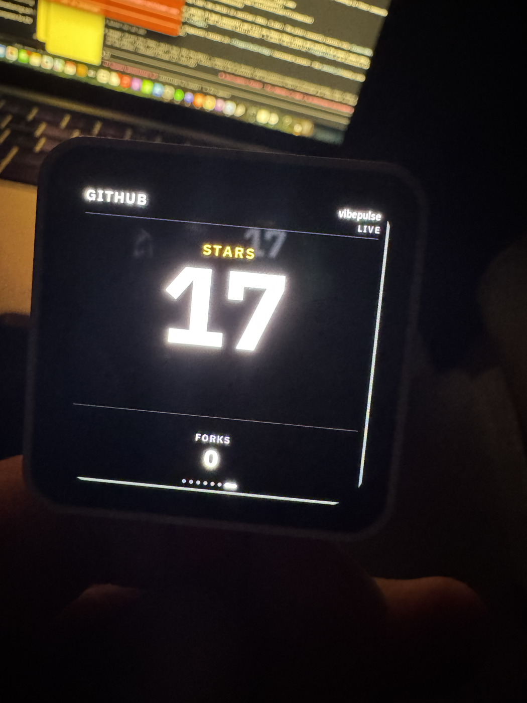

# GitHub star pulse — how it reaches the glass

VibePulse can carry a public GitHub repository's **star and fork count** onto the
panel, and pulse a full-screen celebration when a new star lands. It is an
*optional* module: the display never talks to GitHub. The Mac tokenserver polls
the public API (TLS, rate limiting, backoff live on the computer) and republishes
one flat LAN payload on `/api/github`.

Live on the panel, showing this repo's real count:

## The states

The shared LVGL raster renders the same card across every data provenance
(exact 480 × 480 simulator captures):

| Live | Cached / stale | Waiting (no data) |
|---|---|---|
|  |  |  |

`STARS` is the one dominant metric; `FORKS` is the quiet secondary; the provenance
word (LIVE / CACHED / WAITING) sits top-right so the glass never lies about
freshness. The count is authoritative even when the freshest star's *name* can't
be read yet.

### The star event

When the count rises, a full-screen popup pulses in — the octocat, the repo, a
gold star drawn from ten triangles (no bitmap, no canvas), the actor, and the new
total:

## How it is wired — three layers

1. **Tokenserver** (`tools/tokenserver/github_monitor.py`): one thread polls the
   public repo every 120 s, isolates every failure, and serves the flat payload on
   `/api/github`. Enabled with `--github-repo owner/repository` (or
   `VIBEPULSE_GITHUB_REPO`); no token needed.
2. **Firmware** (`components/app_tokens/`): `github_net.c` fetches `TK_GITHUB_URL`
   every 30 s after a deliberate 20 s startup delay (so GitHub never contends with
   the token/agent feeds at boot); `usage_screen.c` renders the card as an extra
   carousel view; `project_star_popup.c` draws the event.
3. **Config** (`secrets.h`, see `secrets.h.example`): `TK_GITHUB_URL` plus the
   flags `TK_GITHUB_SCREEN_ENABLED`, `TK_GITHUB_NOTIFICATIONS_ENABLED`,
   `TK_GITHUB_SOUND_ENABLED` (all default 0). Since Labs, the first two only
   seed the defaults of a panel without a saved record; the page and the popup
   are switched on in SETTINGS → LABS → MORE.

## What it took to make it live (2026-08-15)

The feature existed in the tree but reached the glass through a four-step chain,
each step a separate reason nothing showed:

1. **The tokenserver wasn't serving GitHub.** The launchd process was running
   pre-GitHub code *and* had no `--github-repo`. Fixed by adding the repo and
   reloading the plist with `bootout` + `bootstrap` — `kickstart -k` restarts the
   process but keeps launchd's *cached* arguments, so it never picks up plist edits.
2. **The firmware shipped without the GitHub view.** The enable flags default to 0
   and were only ever set for the simulator, so `#if TK_GITHUB_SCREEN_ENABLED`
   stripped the whole view from `torget.bin`. Turned on for the device build
   (commit `b5c5a7a`) — see the caveat below.
3. **The card had no data.** `TK_GITHUB_URL` was missing from the local `secrets.h`,
   so the poll task was compiled out (`#if defined(TK_GITHUB_URL)`). Added it.
4. **Delivered** `v0.4.0-5-gb5c5a7a` over OTA (CI-green, clean), verified live at
   **17★**, and a real star (17 → 18) fired the popup on the glass.

## Known follow-ups

- **The enable flags live in the wrong layer (cleanup).** Commit `b5c5a7a`
  hardcodes the three flags in `components/app_tokens/CMakeLists.txt`, but the
  intended design turns them on per-install in `secrets.h` (see the block in
  `secrets.h.example`). The clean state is to revert `b5c5a7a` and set the flags in
  the local, git-ignored `secrets.h` — no commit or CI needed. Left as-is because
  the device works, but a future `secrets.h` copied from the example would redefine
  the flags and silently disable the screen again.
- **Design.** The static card is intentionally minimal (it borrows the token
  screen's layout). A richer treatment — the star on the static screen, motion or
  glow, a star-history sparkline instead of a dead FORKS row — is parked.
- **Housekeeping.** The demo star (18) can be unstarred back to 17; `build-diag/`
  holds a stale pre-GitHub firmware (a ghost-build hazard) worth removing.
