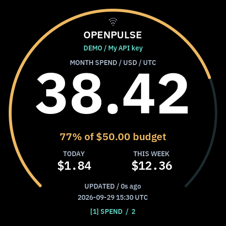
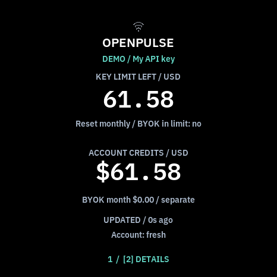
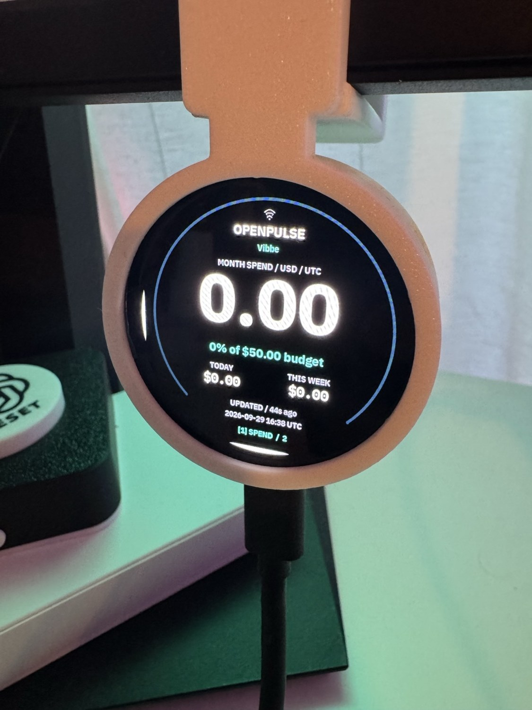

# OpenRouter in VibePulse Labs (OpenPulse preview)

OpenRouter spend on the round Waveshare 1.75 (466 × 466). An optional **OPENROUTER** switch in VibePulse Labs adds the page while keeping
Claude Code, Codex and existing Labs choices. A separate Python service fetches
data; the panel receives only normalized numbers. The first
page puts month spend and the display budget inside the circular glass. Tap
the page indicator/background for key allowance and optional account credits.
Tap the key name to cycle configured keys. The owner verified upright output and the bottom page switch on one round
unit. Full touch-grid, swipe and menu acceptance remain pending.




## Install for OpenRouter only

**Current scope:** a source preview on macOS, first physically checked on the
round **Waveshare ESP32-S3-Touch-AMOLED-1.75**. It is not included in the
v1.3.0 release. Square 2.16 has bench checks, not physical OpenRouter acceptance;
the other board profiles cannot enable this preview. You do not need Claude
Code, Codex or Lovable accounts to use OpenRouter.

The connection is **OpenRouter API → OpenPulse service on your Mac → local
Wi-Fi → display**. Signing in to OpenRouter in a browser does not feed the
panel. The existing API key is read from Mac Keychain. The Mac needs internet,
must stay awake, and must run the service. The display needs 2.4 GHz Wi-Fi and
LAN access to that Mac; a guest network can block this even when Wi-Fi shows
connected. USB supplies power, not the data. The preview has no OpenRouter
relay or automatic service startup.

### 1. Get a separate checkout

Keep existing VibePulse installations untouched. Until this preview is merged
and released, use its branch, not the v1.3.0 download:

```sh
git clone --branch codex/openpulse --single-branch \
  https://github.com/niclasvestlund-YT/vibepulse.git openpulse-panel
cd openpulse-panel
python3.12 -m venv .venv
```

Python 3.11 or newer is required; 3.12 was tested. Substitute your installed
3.11+ interpreter if needed. The OpenPulse service uses Python's standard
library; it does not need the Claude/Codex tokenserver, browser extension or
provider plugins. Firmware tools have their own dependencies in the board guide.

### 2. Try the demo before connecting hardware

```sh
.venv/bin/python -m tools.openpulse.service --demo
```

Open <http://127.0.0.1:8738> on the Mac. Values are labelled DEMO. This reads no
credentials, makes no OpenRouter requests and does not install anything on the
panel. Stop it with Ctrl-C before continuing.

### 3. Save the existing OpenRouter key locally

```sh
.venv/bin/python -m tools.openpulse.service --connect \
  --config .openpulse/config.json --port 8739
```

Open <http://127.0.0.1:8739/connect> on the same Mac. Save the **existing key
whose spend you want**, a display name and a monthly display budget. The key
stays in Mac Keychain, not in the configuration file. Browser login is not
required after saving. A new key does not inherit another key's spend.
The optional management key is needed only for account-wide credits; leave it
blank for key spend and remaining allowance. Never paste keys into chat or Git.

The form is loopback-only. Stop this setup process with Ctrl-C after saving;
its port 8739 is not the physical display endpoint.

### 4. Start the service that the panel can reach

Find the Mac's current private LAN IPv4 address in System Settings → Wi-Fi →
Details → TCP/IP. Reserve it in the router if possible, because the firmware's
OpenPulse address is fixed. Replace `YOUR_MAC_LAN_IP` below with that address:

```sh
.venv/bin/python -m tools.openpulse.service \
  --config .openpulse/config.json --host YOUR_MAC_LAN_IP --port 8740
```

Keep this terminal running. Open `http://YOUR_MAC_LAN_IP:8740/` on the Mac;
verify that the reading is marked fresh and is not DEMO. Also open it from a
phone on the display's Wi-Fi: that checks another device can reach the Mac.
If it cannot, fix the network path before installing firmware. Setup stays on
127.0.0.1; do not add `--connect` to the LAN command. Use a trusted private
network and do not expose port 8740 to the internet.

### 5. Build and install the exact round preview firmware

Follow the [round board guide](../waveshare-175-preview.md) for ESP-IDF setup,
unit identification, a verified private backup and recovery. Use this guide's
OpenPulse build commands below, not the board guide's default quota build:

```sh
test -f secrets.h || cp secrets.h.example secrets.h
test -f openpulse_panel_config.h || cp openpulse_panel_config.h.example openpulse_panel_config.h
```

In the ignored `openpulse_panel_config.h`, set the origin to
`http://YOUR_MAC_LAN_IP:8740` — the **same address and port** used in step 4.
Do not put an OpenRouter API key there. Leave the first-install seed defaults
at 0; enable the page in Labs after installation. Keep `secrets.h` private,
and use the board's phone provisioning or your private Wi-Fi configuration.

```sh
. ~/esp/esp-idf/export.sh
idf.py -B build-openpulse-round -D TORGET_OPENPULSE=ON \
  -D TORGET_BOARD=waveshare_175 -D SDKCONFIG=sdkconfig.openpulse.175 \
  -D 'SDKCONFIG_DEFAULTS=sdkconfig.defaults;sdkconfig.defaults.175' \
  -D TORGET_SOLELKOLLEN_DIR=/nonexistent -D TORGET_WITH_BUDDY=OFF build
```

Your ESP-IDF path may differ. Confirm the build is for `waveshare_175`, with
OpenPulse enabled and no companion apps. **Only after the owner authorizes the
install and the exact unit/backup checks pass**, install over USB using the
same `build-openpulse-round` directory. Follow the board guide's flash/identity
procedure; do not substitute a default `build/`, another board's binary or OTA.
A successful build alone is not an installation or physical acceptance.
When those checks and authorization are complete, replace the port placeholder
with the identified unit's port:

```sh
idf.py -B build-openpulse-round -p /dev/cu.usbmodemYOURPORT flash monitor
```

This command writes the device; do not run it just to test the Mac service.

### 6. Show only OpenRouter

Hold **BOOT for about three seconds → LABS → MORE → MORE**. Set OPENROUTER ON
and CLAUDE CODE/CODEX OFF. Keep the other optional pages off if you want only
the OpenRouter carousel, then tap **RESTART NOW**. Saved Labs choices apply
at restart. Hiding Claude/Codex quota pages does not independently disable
agent-activity monitoring or other previously configured integrations.

The switch exists only in compatible preview firmware. Labs does not download
firmware, save the API key or install/start the Mac service. If OPENROUTER is
missing, check the source branch, board and build flags before changing accounts.

### 7. Verify and keep it running

With the LAN service running and both devices connected, the panel polls every
10 seconds; the service refreshes OpenRouter every 60 seconds. Check the month
reading and UPDATED status, then tap the bottom indicator for key allowance.
Zero spend can be a correct reading; dashes mean a missing value. Account
credits remain off unless a management key was explicitly supplied.

After stopping the terminal, rebooting the Mac or waking it if the process
ended, run the **step 4 LAN command again** from this checkout. Keep the Mac
awake for continuous readings. OpenPulse automatic login/reboot startup and
sleep recovery have not been implemented or certified. The VibePulse
Claude/Codex service installer does not install OpenPulse. If you save a new
key/budget using step 3, restart the separate LAN service to reload its config.
Changing the Mac address requires matching the firmware origin again; a router
reservation avoids ordinary DHCP address changes.

## Troubleshooting dashes and NO DATA

Check **which provider page** is visible first. Claude/Codex dashes are not
OpenRouter spend; choose the OPENPULSE page, or use the OpenRouter-only Labs
choices above. Then check `http://YOUR_MAC_LAN_IP:8740/` and, if needed,
`http://YOUR_MAC_LAN_IP:8740/api/openpulse?key=0` on the Mac. The API contains
summaries, never the OpenRouter key.

| What you see | What to check |
| --- | --- |
| Connection refused / no page on the Mac | Is the step 4 process running, on the correct address/port? Start it again. The demo or setup process alone does not serve the panel's configured endpoint. |
| Source error in the Mac preview/API | Check the configured key in the local connection page and Mac Keychain access. An auth error is different from the display failing to reach the Mac. Browser login does not repair an API key. |
| Fresh on the Mac, unreachable from a phone on the same Wi-Fi | Check LAN address, firewall permission for the service and guest/client isolation. Keep security protections in place; allow only the intended private-network service. |
| Fresh on the Mac, NO DATA or CONNECTION ERROR on the panel | Check the OPENPULSE page, panel Wi-Fi/time readiness, exact compiled origin/port and whether this panel actually polls the service. Fresh host data alone does not prove receipt or successful parsing on the panel. Inspect passive device logs; do not reflash or erase settings as a first step. |
| STALE / old update age | Data is at least 180 seconds old, or the current UTC period needs a refresh. Check Mac sleep, stopped service and provider/network errors. Retained values are last known, not current live spend. |
| 0 USD with UPDATED | This key's current-period usage can be zero. A new/unused key does not show usage incurred by other keys. |
| Account credits absent or error | Account view is optional and needs a management key; key spend/allowance can work without it. A key limit, display budget and account balance are different values. |
| OPENROUTER absent in Labs | v1.3.0 does not contain this preview. Use the preview source, supported board and `TORGET_OPENPULSE=ON`; installation is a separate, user-authorized USB step. |

A Wi-Fi icon only shows network association, not OpenRouter source health.
No OpenRouter browser session is required. A successful HTTP response still
needs panel parsing/rendering and an on-glass observation before claiming the
physical screen is working. USB does not provide a fallback data path.

## Enable on the round panel

In a build with `TORGET_OPENPULSE=ON`, hold BOOT for about three seconds, then
choose **LABS → MORE → MORE → OPENROUTER ON → RESTART NOW**. Swipe horizontally
between enabled provider pages. Tap OpenPulse's bottom indicator for spend or
details. OFF and RESTART NOW removes its page and poller. The normal VibePulse
app registry is retained; this is not a replacement app or a separate launcher.

Existing six- and eight-switch Labs records migrate without changing their
choices. OpenRouter is off by default. For this owner's explicitly requested
installation, the ignored `openpulse_panel_config.h` sets
`OPENPULSE_FIRST_INSTALL_ON=1` to seed it on once during migration, and
`OPENPULSE_START_ON_BOOT=1` to open it on boot when enabled. A later saved OFF
wins. No other provider switch is changed. Recovery to older firmware must use
the verified full backup, including its older Labs record.

## Quick start on this Mac

From this checkout, using Python 3.11+ (3.12 tested):

```sh
python3.12 -m tools.openpulse.service --demo
```

Open <http://127.0.0.1:8738>. Demo never reads credentials or contacts OpenRouter.
It explicitly labels synthetic values. Ctrl-C stops this foreground service.
No launchd job, Windows task, VibePulse config or existing installation changes.

For real data, launch the local connection page on a different port:

```sh
python3.12 -m tools.openpulse.service --connect \
  --config .openpulse/config.json --port 8739
```

Open <http://127.0.0.1:8739/connect>. Paste the **existing API key whose usage you
want to see**, enter a display name and monthly display budget, and save. A new
API key has its own new usage; it will not inherit another key's history. The
form saves secrets via macOS Security.framework in Keychain, under service
`org.openpulse.openrouter`. Each save stages new credential references and
atomically publishes the non-secret configuration only after all writes succeed.
A failed save keeps the previous connection and budget active, including in
other running service processes. Old Keychain entries remain available until
those processes restart; setup never overwrites them. Keys never appear in
process arguments, firmware, fixtures, JSON configuration or request logs.
A denied/locked Keychain produces a safe error; it never falls back to plain text.

The connection form is optional, loopback-only and same-origin. It is absent in
demo mode and cannot be enabled while binding to the LAN. Its default uses a
single key. Browser login alone cannot supply the API secret; OpenRouter masks
previously created keys. Never paste secrets into chat.

The optional management-key field enables account credits. Start without it if
you only want key spend and allowance. A management key has broader privileges;
OpenPulse only issues GET /credits with it, never key-management mutations.
Saved config is non-secret and mode 0600. Changing provider API limits, buying
credits, making model requests and scraping browser sessions are out of scope.

## Configuration and isolation

`tools/openpulse/config.example.json` is the non-secret schema. Without an
explicit `--config`, live configuration is looked up at
`~/Library/Application Support/OpenPulse/config.json`. This task uses the
checkout's ignored `.openpulse/config.json`, with no VibePulse paths or services.

- Up to eight explicitly configured key ids; each has its own display budget.
- Default budget $50/month; warning at 75%, critical at 90%. Edit `warning_at`
  and `critical_at` in the config to choose thresholds. `monthly_budget_usd: null`
  disables the display budget. Reload the foreground process after config edits.
- The form intentionally starts with one key. Add further key entries to the
  config, and save each secret using the hidden terminal prompt below.
- Manual configuration defaults to Keychain account `management` for credits.
  The connection form creates separate, versioned references for both secrets
  (`credential_id` per key and `management_credential_id` for the account).
  References are non-secret; use the form again to replace a saved connection.
  Restart any separate LAN service after saving. Unused older entries may be
  removed from the OpenPulse namespace in Keychain Access after those processes
  stop. A failed cleanup can leave an inactive entry, never a switched account.
- No local spend history or persisted source cache in v0.1. Restart starts with
  dashes until a new response, avoiding stale cache/credential mixups.
- The service polls each source every 60 seconds, with bounded 8-second network
  calls and 30–600 second error backoff. HTTP readers copy snapshots without
  waiting for provider I/O. Key and account freshness/error states are separate.
- Foreground only: no automatic start/sleep-resume certification yet.

For manual configuration without credential references:

```sh
python3.12 -m tools.openpulse.service --save-key default
python3.12 -m tools.openpulse.service --save-key management  # optional
```

The terminal prompt hides input. For temporary development only, a namespaced
`OPENPULSE_KEY_<CREDENTIAL ID IN UPPERCASE>` environment value can override a saved key;
never write it in shell history, Git or a launch script. Keychain is preferred.

## Meaning of the numbers (official documentation checked 2026-09-29)

| UI value | Source / scope |
| --- | --- |
| Today, week, month | [GET /key](https://openrouter.ai/docs/api/api-reference/api-keys/get-current-api-key): `usage_daily`, `usage_weekly`, `usage_monthly`, OpenRouter credit usage for **that key**, USD. UTC day/month; week Monday–Sunday. |
| Key remaining | `/key` `limit_remaining`, respecting provider reset/BYOK rules; never derived from lifetime usage. Explicit `limit: null` means unlimited; absent/invalid means unknown. Zero is a real zero. |
| Display budget | A local monthly reminder compared only with that key's monthly OpenRouter credit spend. Does not enforce or change a provider cap. |
| Account credits | [GET /credits](https://openrouter.ai/docs/api/api-reference/credits/get-remaining-credits), management key required: `total_credits - total_usage`. Separate account-wide balance, not a key allowance. Negative balance remains negative. |
| BYOK | `/key` external BYOK fields remain separate and are excluded from the display budget. Details state whether OpenRouter includes BYOK in the key cap. |

[GET /activity](https://openrouter.ai/docs/api/api-reference/analytics/get-user-activity-grouped-by-endpoint)
requires a management key and covers 30 **completed UTC days**. It is not live
activity and is not fetched in v0.1. Model breakdowns and forecasting are deferred.

A successful fetch is a recent observation of OpenRouter's counters, not proof
that every inference is instantly reflected. At 180 seconds readings are stale;
connection/auth failures are shown immediately while retaining last known values.
Current-period values become unknown across a UTC boundary until refreshed.
The panel also ages data locally if the host disappears. It does not advance
provider counters or simulate spend between polls. Source/account status is
independent of the platform's Wi-Fi association icon.

## Native preview and development checks

```sh
python3.12 -m venv .venv
.venv/bin/pip install -r requirements-dev.txt -r requirements-interaction-relay.txt
cmake -S sim -B sim/build-openpulse-round -G Ninja \
  -DTORGET_BOARD=waveshare_175 -DTORGET_BUILD_OPENPULSE_SIM=ON \
  -DTORGET_SOLELKOLLEN_DIR=/nonexistent \
  -DTORGET_WITH_BUDDY=OFF
cmake --build sim/build-openpulse-round --target openpulse-sim --parallel 2
sim/build-openpulse-round/openpulse-sim --url http://127.0.0.1:8738
.venv/bin/python -m tools.openpulse.preview --out .openpulse/round-previews
.venv/bin/python -m unittest tools.openpulse.test_openpulse
PYTHON_BIN="$PWD/.venv/bin/python" ./test/run.sh
```

The renderer and parser are identical C sources in the simulator and firmware.
Captures include the existing neutral Wi-Fi asset at the platform's actual
position. The fixture tool checks text widths and every pixel outside the
466px disk, on both pages and eight states. It produces sample data only, never
real account screenshots in the repository. Use the native macOS SDL driver;
this Mac's offscreen/dummy SDL exits before capture. Linux CI may use offscreen.

The legacy host visual test detects an installed Solelkollen companion under
HOME. On this Mac, the **legacy test simulator** must keep its default companion
path for those existing tests. The OpenPulse simulator and firmware explicitly
exclude companions; the Labs build retains VibePulse's normal application registry.

## Firmware build and authorized installation

The first physical target is `waveshare_175`. Native round and `waveshare_216`
square compositions have bench checks; square physical acceptance is pending. Other OpenPulse board
profiles fail early. Reuse Torget's existing board/display/Wi-Fi/HTTP support.
The standard VibePulse registry stays unchanged. The OpenRouter view and poller
are created only when the compiled-in Labs option is active.

```sh
test -f secrets.h || cp secrets.h.example secrets.h
test -f openpulse_panel_config.h || cp openpulse_panel_config.h.example openpulse_panel_config.h
# Edit only the local Mac origin in openpulse_panel_config.h, no OpenRouter keys.
. ~/esp/esp-idf/export.sh
idf.py -B build-openpulse-round -D TORGET_OPENPULSE=ON \
  -D TORGET_BOARD=waveshare_175 -D SDKCONFIG=sdkconfig.openpulse.175 \
  -D 'SDKCONFIG_DEFAULTS=sdkconfig.defaults;sdkconfig.defaults.175' \
  -D TORGET_SOLELKOLLEN_DIR=/nonexistent -D TORGET_WITH_BUDDY=OFF reconfigure
cmake --build build-openpulse-round --parallel 2
```

For an eventual physical connection, run the live service with an explicit
private LAN bind and without `--connect`. The endpoint is plaintext LAN HTTP
and contains financial summaries; use only a trusted private network, never
port-forward it to the internet. Setup must remain on loopback. The panel polls
the explicitly configured OpenPulse origin every ten seconds; it does not use
VibePulse discovery, relays or API keys. USB currently supplies power, not the
OpenPulse data transport.

Physical installation requires explicit authorization, exact ROM identity and
a verified full backup. USB-down display orientation, touch alignment, memory/network
soak and the whole physical data path need their separate acceptance. Existing VibePulse physical
verification is not inherited by OpenPulse. No release or Windows support claim.

The integrated round Labs test is `python test/test_openpulse_labs.py`. It drives
ON/OFF, the restart action, the existing Codex page and both OpenPulse pages
through shared LVGL. It also clicks the key selector from warning and critical
states and verifies that the empty display uses the neutral accent until the
new key's data arrives. The policy tests cover all 512 masks, migration and durable
OFF behavior. `sim/build-openpulse-round/openpulse-sim` remains a focused design
preview; the actual panel runs the complete VibePulse app with the optional page.

The authorized installation and its acceptance limits are recorded in the
[round 1.75 checkpoint](physical-2026-09-29.md).

## Display validation

| Display | OpenRouter status |
| --- | --- |
| 1.75 round, 466 × 466 | Native LVGL states and Labs on/off tested; live reading, upright output and bottom page switch confirmed on one physical unit. |
| 2.16 square, 480 × 480 | Native LVGL bench checks; firmware compiled in CI. No physical OpenRouter acceptance yet. |
| 2.41 V2, 1.91 Touch, 1.8 V2 | Existing VibePulse builds remain covered by CI. OpenRouter is not enabled: these need their own layout and physical acceptance. |

OpenRouter remains a source-build preview, not part of the v1.3.0 release.
Its optional host service is currently documented and connected on macOS only.
The Labs switch does not install firmware or configure the host automatically.



Owner photo, 29 September 2026, an actual reading at capture time. This is not
a live website reading or evidence for other displays. Re-encoded at web size
without camera/GPS metadata; no retouching.
