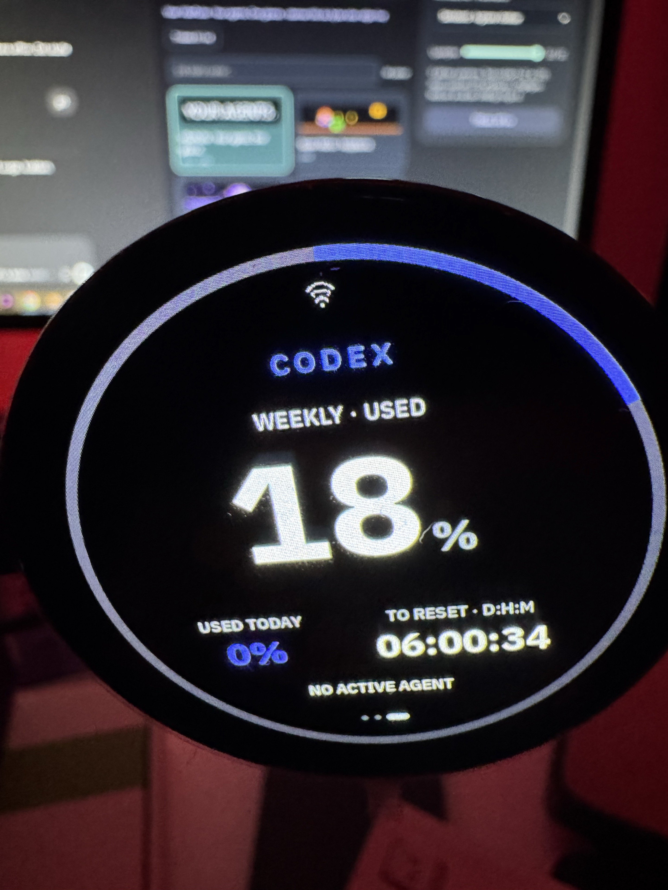
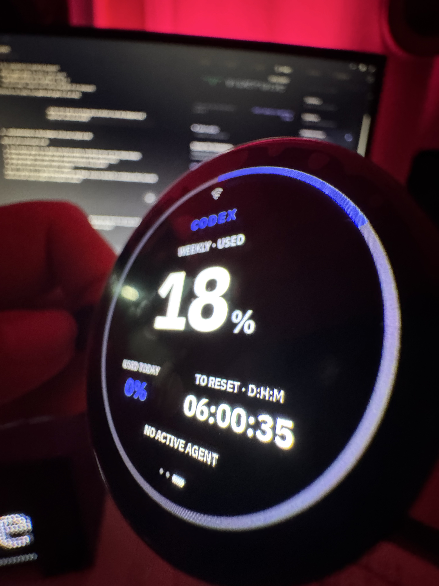
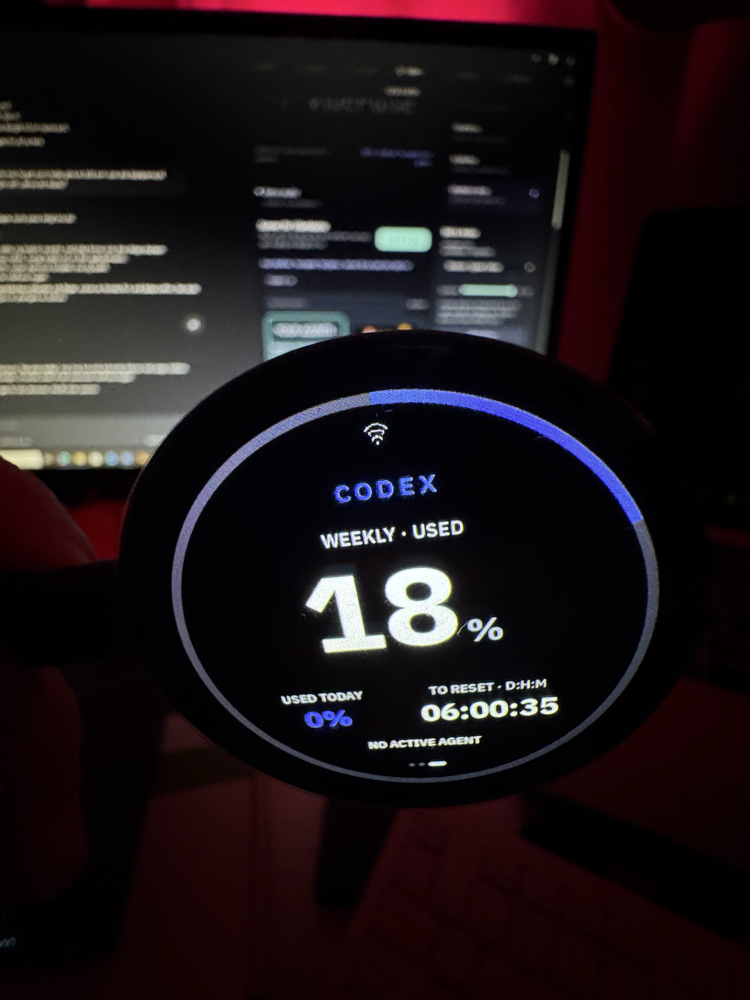

# Round 1.75 AMOLED — owner-visible quota checkpoint

Date: 2026-09-24. Unit: `vibepulse-175-01`. The owner can read only `1.75`
on the board; PCB revision and any suffix remain unknown. This report covers
the USB-down trial app with SHA-256
`854d92e9e64da72d5dd745af7100b6d636ef764ac41ab125d43707ae90f073ff`.
It does not cover the later two-scan Wi-Fi change, which is built but has not
been installed on this unit.

## Observed

- The board-specific normal app booted with the CO5300/CST9217 466 × 466
  profile. The USB installation verified all written segments against their
  source hashes; a private double-read of the original 16 MB flash preceded it.
- Serial logs recorded a saved 2.4 GHz network reconnect, DHCP, time sync and
  repeated successful token fetches.
- Three owner-supplied photographs show the **real** round panel displaying
  the Codex weekly page. The frontal frame reads 18% used, USED TODAY 0%,
  TO RESET 06:00:34, and NO ACTIVE AGENT. The ring, Wi-Fi icon, labels,
  numbers and page indicator remain inside the circular glass. The angled
  and held views show the same content from different positions. These are
  momentary readings, not fixture data or a promise of current quota values.
- The four outlined boxes in the earlier photograph were LVGL's default
  `Text` on number-only fonts before the first network payload. The installed
  build initializes those labels to unavailable dashes; the new photographs
  show numeric values instead of the boxes.

## Boundary

The photos establish a readable physical Codex quota page and a live-looking
countdown on this unit. They do not independently prove the percentage matches
the host reading at the instant of exposure; the service value observed later
was 19%. The USB connector is outside these frames, so its downward physical
position cannot be inferred. The photos also cannot prove touch alignment,
page swipes, Wi-Fi list completeness, reply actions, OTA or automatic rotation.
The owner has been asked to confirm the fixed orientation and touch behavior.
The current source disables the whole-screen burn-in drift timer on this board
and hides the timed Needs You countdown arcs until a physical motion review;
the photographs do not validate animation.

The first portal scan on this unit listed only a printer although a boot scan
had seen the owner's network. Exact-name entry recovered setup. A later
source change merges two scans before the portal opens, but no on-device
retest has occurred because the target USB identity was absent when the
installation was attempted. The installer stopped before writing. Do not
attribute the source change to these photographs or call the scan issue
physically resolved.

The current board source is a USB-installed bench profile after v1.1.0.
The photographed USB-down trial predates the reviewed USB-only OTA gate and
computer-only Needs You fallback. Until a later build is installed and its
touch behavior verified, do not use UPDATE or answer prompts on this unit;
use the computer for decisions and USB for firmware changes. The source gate
does not retroactively change the installed image.
The three photographs are supplied by the owner for the public VibePulse and
VibeOnChip presentation. They contain no location or camera-device EXIF tags.
Private raw serial logs, credentials, firmware binaries and flash backups are
not part of this report.
