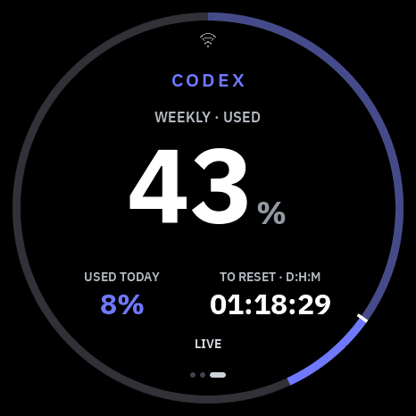
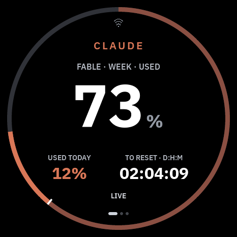

# Round 1.75 bring-up and native preview

The owner chose a circular quota ring, USED TODAY and a D:H:M countdown.
The native LVGL view uses the same quota presenter and daily-usage validation
as the existing screens. The `waveshare_175` firmware profile now builds and
has booted on the named round unit. The owner photographed the quota page,
and the unit has joined Wi-Fi and fetched token data. Final visual/touch
review, the USB-down angle and live value accuracy are still pending,
so this is a bring-up guide, not a supported release or physical-review report.

```sh
PYTHON_BIN=.venv/bin/python tools/preview-ui.sh vibepulse waveshare_175
```

The returned private directory contains 466 × 466 PNGs: live and cached/stale
with identical values; missing total, today or reset; contradictory today;
zero and full usage; longest countdown; early exhaustion; wide quota copy;
five-target touch diagnostics; settings/about/Labs; and QR/manual/searching/failed
Wi-Fi states. All twenty fixtures are checked against the circular mask. The
host gate also renders more than 100 complete app/overlay states and checks
that visible pixels remain within the 466px disk.

## Design and semantics

- Native Plex fonts; fixed Claude #D97757 and Codex #6F78FF accents.
- One dominant percentage. The muted ring is earlier usage, the bright
  terminal segment is today's contribution to the same allowance.
- Missing today is a dash, not zero. Invalid today does not draw a misleading
  partition. Zero and 100% are tested separately.
- The countdown is DD:HH:MM, without seconds. The accompanying label says
  TO RESET or TO EMPTY, preserving the presenter's forecast decision.
- Unknown deadlines show a dash. Durations above 99 days display >99D;
  normal minute-resolution data is not replaced with a fabricated timestamp.
- The preview follows supplied fixture minutes. The normal firmware keeps its
  existing live presenter and refresh path; physical reset timing remains to
  be checked against a connected host.

## Recovery and physical test plan

Confirm the exact unit and revision against the vendor schematic/BSP before
enabling its power rails. Obtain explicit permission for backup and flash.
With the intended unit selected, read the complete detected flash twice and
compare SHA-256 hashes. Keep both the original image and identity/protection
report private. Check secure-boot/flash-encryption status before assuming a
raw backup can be restored. Do not erase NVS or flash when identity or recovery
is uncertain. Record exact bootloader-entry and restore commands for this unit.

The low-brightness static diagnostic used the vendor-native orientation and
paired touch transform. Its serial log recorded N/E/S/W/C touches, but the owner
must still confirm the visible image, colors and matching counters. Simulator
clicks and serial counts alone do not prove the visual mapping. Motion remains
behind static physical review and measured stress.

## Remaining work before public support

The normal application profile now builds and renders quota, attention,
completion, analytics, settings, Wi-Fi and OTA at native resolution. The
separate `TORGET_ROUND_DIAGNOSTIC=ON` profile remains available for bench
recovery. The named unit has booted the normal profile, saved a Wi-Fi network,
received an IP address and fetched tokens. Confirm the USB-down angle and
touch locations, compare the values on glass to the source, verify the reply
loop, and record a
named-unit physical report before claiming public support. Other boards do
not confer OTA or motion approval on this one.

Publish the verified guide and captures in VibePulse open source, then update
the VibeOnChip presentation with the same support boundary and guide link.
The owner requested both destinations; neither may inherit another board's
physical certification.

## Reusable lessons and native evidence

The owner could read only `1.75`; the registry keeps the unknown PCB revision
explicit. The 480px app contract is centred at (-7, -7), while all visible quota
pixels stay inside the physical 466px disk. Measure number text before placing
its percent unit: reading a lazy x-coordinate on an offscreen page caused an
overlap in the first native draft. No new canvas or full-screen layer is used.

The native preview command checks actual pixels for the circular mask, the
hero/stat gap, readable caption landmarks, quota/today ring partitions, same-data
live/stale provenance and RGB diagnostic swatches. These checks run in the host
gate. The shared presenter tests preserve original adaptive duration strings
and separately check the raw minutes and D:H:M formatter.





These are simulator captures, not photographs of the connected panel.


## Black screen after swapping displays (2026-09-23)

The round unit enumerated over USB but stayed black after software reset and
full USB power cycling. A private flash read found the **1.91 recovery app**:
its complete image SHA-256 matched that task's recorded recovery artifact.
Six older flashing logs concerned the correct 1.91 unit, but did not cover the
later installation. Do not use incomplete logs to dismiss an owner's report.
The app's embedded digest was valid; this was an image for the wrong board,
not evidence that the round panel itself had failed.

A USB path such as `/dev/cu.usbmodem1101` is reusable when boards are swapped.
Before every write, select the USB identity, connect, read and compare the
ROM MAC, and keep that same connection for the write. Keep exclusive serial
ownership through boot verification when multiple tasks are active. Record
board profile, app hash, unit identity and boot result together in private
bench evidence. Publish only sanitized findings. A backup taken now preserves
the current wrong image; it must not be called a factory recovery image.

The diagnostic driver is based on the vendor BSP and schematic at
`waveshareteam/ESP32-S3-Touch-AMOLED-1.75@e4344e70c2fa78a13e8a06566507f1ba8af6672a`.
It uses CO5300 QSPI CS12/CLK38/D4–7, display reset39, gap6/0; CST9217 on
SDA15/SCL14, reset40/IRQ11, native no-swap mirrored X/Y. LCD and touch use
VCC3V3; the vendor display path does not reprogram AXP2101. PCB revision stays
unknown. The vendor-derived panel sequence's Apache-2.0 license is retained
in `components/torget_board/LICENSE.vendor-175`.


## First diagnostic installation

Private double reads of the complete 16 MB flash matched. The authorized
static diagnostic `v1.1.0-17-gf71534f` was installed with all four written
segments hash-verified. Its app file SHA-256 is
`fc1857fea87a1f27afbc4a766d234b3faf0a68462b5b6d89fed9d92fd5dd1960`.
USB boot logs identify the selected 1.75 profile, and CST9217 reports 466 × 466,
chip 0x9217. At the diagnostic screen, the largest internal DMA block was
237,568 B for a 7,456 B transfer; free internal memory was 327,659 B.
These are unloaded diagnostic measurements, not network/TLS stress results.
Owner verification of visible pixels and N/E/S/W/C mapping is pending.
Full VibePulse application support was still pending at this diagnostic stage.

## First normal application boot

The owner then authorized VibePulse installation on the same unit. The normal
`waveshare_175` app was built separately from the diagnostic and its image
checksum was valid. The writer checked the ROM identity, two matching private
flash backups, the normal-app board marker and disabled flash protections
before writing. Bootloader, partition table, OTA selection and the 2.0 MB app
were each hash-verified; NVS was preserved. The installed app file SHA-256 is
`1c4a05780a0b15eb4932f218326c33432ee607b043aff70dd98f56a158018274`.

Serial boot identifies the **normal** board-175 VibePulse profile, CO5300
466 × 466/gap6/0, and no saved Wi-Fi credentials. The local setup portal
opened automatically after roughly 90 seconds without an IP address; the
largest DMA block stayed above 51 KB after portal start, versus a 7,456 B
display transfer. This proves firmware boot and portal startup, not what the
owner can see on the glass or a live quota reading. A phone can scan the QR on
the panel or join its local setup network and visit `http://192.168.4.1/`;
enter Wi-Fi credentials there, not in an issue or chat. The first portal scan
listed only one printer although the boot scan had seen the owner's 2.4 GHz
network. The form now offers **My network isn't listed**, which accepts an
exact typed SSID with a required password and still saves it only after a
successful connection. The reason for the inconsistent scan is unconfirmed.
Owner review and a service-to-panel reading remain the next acceptance checks.

## USB-down orientation trial (2026-09-24)

The owner confirmed that the native image was upright with USB at the left,
and requested USB at the bottom for the initial fixed mounting. The trial
firmware applies one clockwise hardware quarter-turn (CO5300 MADCTL `0x60`)
under the LVGL lock and applies the inverse 466px touch-coordinate transform.
It also initializes the quota labels before the first network payload;
otherwise LVGL's default `Text` appeared, with letters rendered as boxes in
numeric fonts. The installed app SHA-256 is
`854d92e9e64da72d5dd745af7100b6d636ef764ac41ab125d43707ae90f073ff`.
All four flash segments verified, and the normal app rebooted, joined the
saved Wi-Fi and fetched tokens. Owner visual confirmation of the new angle
and touch alignment is pending. The QMI8658 is vendor-listed on this board,
but automatic rotation remains disabled until its axes are calibrated on
this unit and a four-pose physical test is complete; the 2.16 constants do
not transfer.

## Empty quota on first boot

An unset round LVGL label showed its default `Text` on the owner's photo;
the number-only font rendered those letters as four outlined boxes. The
USB-down build initializes all three quota pages with unavailable values
before the first network reply. Those initial dashes mean **no reading yet**,
not zero usage. A valid quota response then replaces them.

The panel does not persist its last quota in its own flash. Without Wi-Fi
after a cold start it therefore cannot reconstruct an old percentage. While
running, a previous value can remain visible but is marked stale after two
minutes without a successful fetch.
The Mac-side token service has a separate expiring quota cache that can supply
a stale-marked reading after reconnection. A successful HTTP parse and
`stale codex=0` log line alone do not prove that `codexWeekPct` is present:
check the response's percentage and reset fields, then compare the actual
glass. Keep LAN addresses and raw responses out of public reports.
