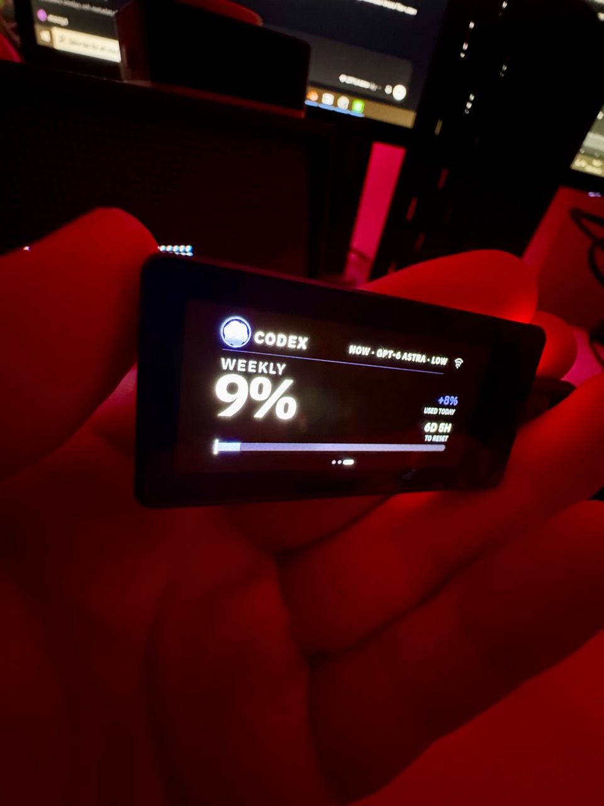
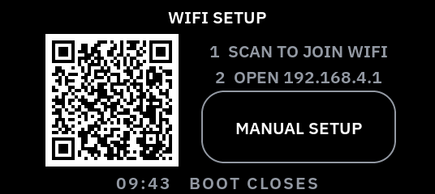
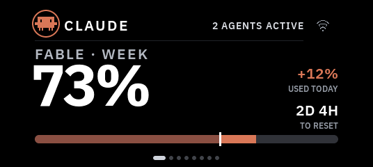
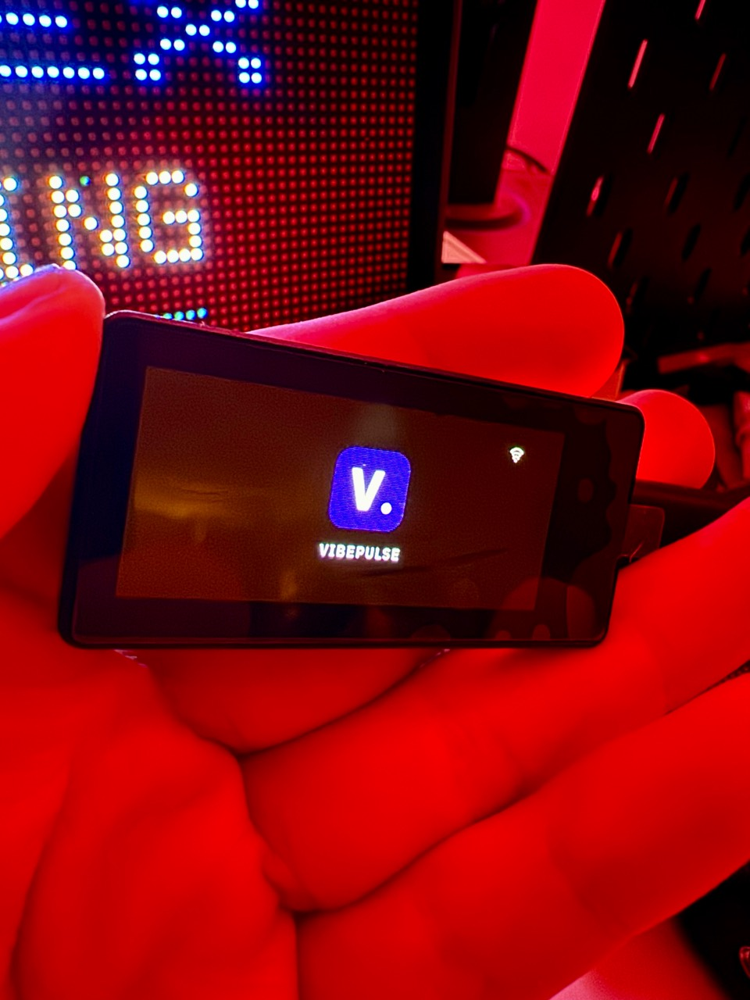

# Install VibePulse on Waveshare 1.91 Touch AMOLED

**USB-installed development port:** phone provisioning, saving the network, reconnecting after reset, visible Codex usage and page swipes pass on one physical unit. The FT3168 can still intermittently NACK; a later full USB power cycle restored touch after a persistent failure. See [the physical report](superpowers/reviews/2026-09-23-waveshare-191-touch.md) for exact evidence and remaining checks.



*Real 1.91-inch panel, photographed on September 23, 2026. The 9% weekly quota is a momentary account reading, not sample data. Red room light prevents a reliable color comparison.*

This development port targets **ESP32-S3 Touch AMOLED 1.91**, in fixed landscape
**536 × 240**. Select `waveshare_191_touch` explicitly. The default profile still
builds the 2.16-inch board. This port is not part of the v1.1.0 release.

The September 23, 2026 installation established USB programming and a working
four-corner touch diagnostic. The owner reported `1:1 2:1 3:1 4:1`, confirming
one correctly mapped touch in each corner. Wi-Fi provisioning, NVS persistence, automatic reconnection, local usage fetch and page swipes also passed. PCB revision, long-running touch stability, full physical UI review and optional peripherals remain unverified.

## Prepare

Follow [agent setup](agent-setup.md) for the computer service. Reuse an existing
healthy tokenserver. Adding this panel does not require reinstalling that service.
The initial port was built on macOS using ESP-IDF 5.5.2 and LVGL 9.5.0.

```sh
test -f secrets.h || cp secrets.h.example secrets.h
. ~/esp/esp-idf/export.sh
```

Set `TK_VIBEPULSE_BASE_URL` in the private `secrets.h` to your computer's reachable
LAN address. On macOS, `scutil --get LocalHostName` gives its Bonjour name.
Keep the endpoint macros enabled. Discovery is attempted before this fallback.
Wi-Fi fields may remain empty for phone provisioning after installation.
Device approval keys and relays are optional; they are not needed for usage display.

Before the first install, identify the actual USB port and read a private backup:

```sh
python -m esptool --chip esp32s3 --port /dev/cu.usbmodemYOURPORT flash_id
mkdir -p backups
python -m esptool --chip esp32s3 --port /dev/cu.usbmodemYOURPORT read_flash 0 0x1000000 backups/factory-private.bin
python -m esptool --chip esp32s3 --port /dev/cu.usbmodemYOURPORT verify_flash 0 backups/factory-private.bin
```

The tested unit has 16 MB flash and 8 MB PSRAM. Keep the backup and built firmware
private: flash images can contain network configuration. Do not attach them to a
public guide or release.

## Build and test the board

```sh
idf.py -B build-191 -D SDKCONFIG=sdkconfig.191 \
  -D TORGET_BOARD=waveshare_191_touch \
  -D TORGET_SOLELKOLLEN_DIR=/nonexistent \
  -D TORGET_BUDDY_DIR=/nonexistent \
  -D TORGET_BOARD_DIAGNOSTIC=ON build
idf.py -B build-191 -p /dev/cu.usbmodemYOURPORT flash
```

The static diagnostic labels the native dimensions, draws color samples and four
numbered touch targets. Inspect orientation and colors, then touch each target
once. Every counter should become 1 in its corresponding corner. Record actual
results for each new hardware revision rather than inheriting this unit's results.

Build the normal application explicitly with the diagnostic disabled:

```sh
idf.py -B build-191 -D SDKCONFIG=sdkconfig.191 \
  -D TORGET_BOARD=waveshare_191_touch \
  -D TORGET_BOARD_DIAGNOSTIC=OFF build
idf.py -B build-191 -p /dev/cu.usbmodemYOURPORT flash monitor
```

Use the generated flash arguments through `idf.py`; do not guess partition offsets.
If there are no saved networks, join the temporary `VibePulse-setup` network from
your phone. The QR code joins that network; it does **not** open the setup page.
After joining, open `http://192.168.4.1` manually in your phone browser, select
your 2.4 GHz home network, enter its password and submit. Keep the USB monitor
open rather than reconnecting it during setup; opening this unit's serial port
can reset it. If the temporary network's saved password fails after a reboot,
forget that network and use the password currently shown on the panel. A first
`NO_AP_FOUND` message can be transient; allow the retry to finish and confirm
that the screen joins the home network. Then check for real Claude/Codex usage
and reset information. Missing data must remain a dash, never a fabricated zero.



*Simulator capture at the panel's native 536 × 240 size.*

If the serial log says `1.91 touch unavailable`, the display continues to boot
without touch instead of restarting in a loop. Disconnect USB power for about
ten seconds, reconnect, and check touch again. Wi-Fi setup can still open after
its normal wait because it is operated from the phone; touch-dependent swipes
and menu taps will not work until the touch controller responds. If the saved
network does not reappear after a flash, repeat phone setup rather than
assuming the old credentials survived.

## Controls and current limits

Swipe between pages. Hold BOOT while the application is running to open Settings.
Holding BOOT while resetting instead enters the chip's download mode.
Updates for this profile use USB; the Settings update control says `UPDATE VIA USB`.
Automatic rotation and new motion effects are disabled for this first static port.

The main content occupies a centered 480 × 240 viewport; the panel driver and
native screenshots are 536 × 240. Layouts are rearranged for the available height,
not stretched from a square image. Needs You alerts remain visible, but all
decisions are handed to the computer on this development port. On-glass
approval and denial are disabled until a compact layout can preserve the
90 px touch-target rule and pass a physical answer round trip.

[Hardware and pin evidence](../spec/boards/waveshare_191_touch/hardware.md) ·
[Port implementation notes](porting-waveshare-191-touch.md)



*536 × 240 native LVGL fixture; not live account data or a panel photograph.*



*Real panel during startup; the logo alone does not prove Wi-Fi or usage is ready.*
