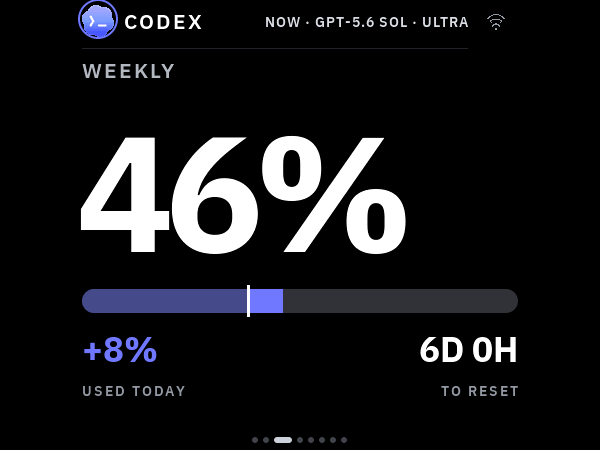
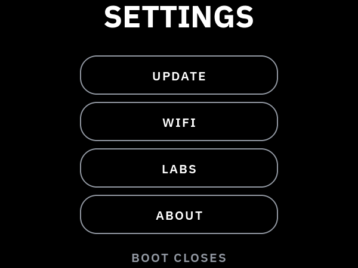

# Install VibePulse on Waveshare 2.41 V2

**Supported in current source:** Waveshare ESP32-S3-Touch-AMOLED-2.41 **V2**,
fixed landscape **600 × 450**. Display bring-up, four-corner portrait touch,
USB installation, Wi-Fi and visible Claude/Codex usage passed on a real unit.
See the [physical report](superpowers/reviews/2026-09-17-waveshare-241-v2-physical.md)
for the exact build and limits. The older v1.1.0 tag does not contain this port.



*Native LVGL simulator capture with fixture data, not a photograph or live account data.*

## 1. Check the revision before building

Waveshare identifies V2 by **Rev2.0 on the PCB or V2 on the enclosure's QC
label**. V1 and V2 have different reset wiring. **V1 is not supported by this
profile.** Neither the old 2.16 image nor a generic ESP32-S3 image is suitable.

The board has 16 MB flash, 8 MB octal PSRAM, an RM690B0 AMOLED controller and
FT6336 touch. The vendor uses the SH8601 transport and FT5x06 touch drivers;
those driver names do not identify different physical silicon.
[Pin/reset/rotation reference](../spec/boards/waveshare_241_v2/hardware.md).

## 2. Prepare the computer and local configuration

Use the [agent setup runbook](agent-setup.md) to prepare the existing or new
Mac/Windows tokenserver. Reuse a healthy running service; adding a second
panel does not require reinstalling it or enabling a relay. Firmware installation
below was tested on macOS with **ESP-IDF 5.5.2**. Windows host support is a
separate claim; use its ESP-IDF environment and COM port when building there.

From a current checkout, preserve any existing configuration:

```sh
test -f secrets.h || cp secrets.h.example secrets.h
. ~/esp/esp-idf/export.sh
```

In `secrets.h`, replace `DIN-MAC` in `TK_VIBEPULSE_BASE_URL` with the reachable
computer name/address. On a Mac, `scutil --get LocalHostName` gives the Bonjour
name. Keep the endpoint macros enabled. Automatic `_vibepulse._tcp` discovery
is tried first; the compiled address remains the fallback.

You can leave both Wi-Fi pairs empty and provision from a phone after flashing.
An old `secrets.h` with empty fields does not contain the networks stored in
another panel's NVS. A failed keychain lookup is a missing credential, not
proof of an open network. Never copy all of another panel's device/OTA/relay
keys just to transfer its Wi-Fi settings. Optional integrations stay opt-in.

## 3. Build the exact board profile

Firmware and simulator use the same `TORGET_BOARD` selector. Unknown values
fail configuration; the default remains `waveshare_216`. Keep a separate build
and generated SDK configuration for each board:

```sh
idf.py -B build-241 \
  -D TORGET_BOARD=waveshare_241_v2 \
  -D SDKCONFIG="$PWD/sdkconfig.241-v2" \
  -D TORGET_SOLELKOLLEN_DIR="$PWD/no-companion" reconfigure
cmake --build build-241 --parallel 2
```

Two build workers avoid the memory pressure seen on an 8 GB Mac. This builds
VibePulse only; Buddy/audio and companion layouts are not validated on V2.
LVGL is pinned to **9.5.0** in both target and simulator. If reusing a generated
configuration from a different LVGL version causes `empty filename in #include`
for `CONFIG_LV_ASSERT_HANDLER_INCLUDE`, preserve that file separately and
regenerate this board's SDK config from the pinned defaults. Do not delete
`secrets.h` or erase the device's NVS as a build fix.

Optional native preview, with the host dependencies from `requirements-dev.txt`
and SDL2/CMake/Ninja installed:

```sh
PYTHON_BIN=.venv/bin/python tools/preview-ui.sh vibepulse waveshare_241_v2
```

This produces the same shared LVGL UI at 600 × 450, including settings and
Wi-Fi setup. It never contacts or flashes the panel. Review the static images
before installation. See [adding another display](adding-a-display.md) for the
full engineering acceptance process.

## 4. Back up and install over USB

**Ask the owner for explicit permission before replacing firmware.** Identify
the intended USB device with `python -m serial.tools.list_ports -v`; do not pick
the first port when several boards are attached. Substitute its actual port:

```sh
VIBEPULSE_PORT=/dev/cu.usbmodem1101   # example; verify your own device
mkdir -p backups
chmod 700 backups
umask 077
python -m esptool --chip esp32s3 -p "$VIBEPULSE_PORT" \
  read_flash 0x0 0x1000000 backups/before-241-v2.bin
python -m esptool --chip esp32s3 -p "$VIBEPULSE_PORT" \
  verify_flash 0x0 backups/before-241-v2.bin
idf.py -B build-241 -p "$VIBEPULSE_PORT" -b 460800 flash
```

Keep the full backup private: it may contain earlier network credentials.
Wait for successful hash verification of every written segment. Flash the
**bootloader, partition table, initial OTA data and app together** using the
build's flash target; the stock/demo and VibePulse app offsets differ.
Do not copy an app address from another example. `build-241/flash_args` is the
source of the addresses for this build.

If automatic download entry fails, hold BOOT, tap RESET (or reconnect USB),
then release BOOT before flashing. Release BOOT for normal startup too:
GPIO0 is the ESP32 download-mode strap. Recovery uses the same download mode;
authorized restoration writes the private full backup at address `0x0` to
**the same unit**. Keep the backup until the new installation is accepted.

OTA was not provisioned or physically tested in this port. Use board-specific
USB updates for now. Do not send a 2.16 image to V2, including one advertised
by an older computer installation. Personalized binaries are not release assets.

## 5. Connect and verify on the glass

1. Hold **BOOT for three seconds**, choose **WIFI**, and scan the QR code.
   Setup also opens automatically after about 90 seconds without a network.
2. Use the phone's local portal to select a **2.4 GHz** network and enter its
   password. If the portal does not open, use `http://192.168.4.1/` while
   connected to the panel's temporary Wi-Fi. MANUAL SETUP shows fallback details.
3. Keep the computer service running and reachable on the same LAN, TCP 8737.
   Check quotas, provider labels, touch and page navigation on the actual panel.
4. Record the firmware version from SETTINGS → ABOUT and whether data is
   live, cached/stale or missing. Visible Claude values do not establish an
   active subscription or current credentials. Diagnose source freshness
   separately from display hardware.



The port keeps native fonts/icons and the existing 480-pixel app composition,
centred horizontally with 15 pixels less space above and below. Footer, border
and pager positions fit the shorter glass. **Automatic rotation is disabled.**
The original square-board IMU calibration is not transferable.

## Troubleshooting from the first installation

| Symptom | Check |
|---|---|
| Black display or non-working touch | V2 marking, V2 build selection, expander-controlled resets; do not reuse 2.16/V1 pins. |
| A missing strip or displaced image | RM690B0 address gap: portrait x=16/y=0, landscape x=0/y=16. One vendor LVGL demo omitted it. |
| Image correct but touch displaced | Panel MADCTL and touch transformation must change together. |
| SETTINGS never opens | V2 uses BOOT/GPIO0. GPIO18 is an expander interrupt, not the original board's KEY3. |
| Text cut off near the bottom | Use the 600 × 450 preview, including setup, attention and settings screens; a 480 × 480 screenshot cannot prove fit. |
| Memory pressure during build | `cmake --build build-241 --parallel 2`; avoid a large number of C++ compiler processes on a small Mac. |
| Restart while reading logs | A USB reset was recorded when reopening serial, despite attempts to keep DTR/RTS deasserted. Do not call repeated opens passive; stop logging during phone setup. |
| Quotas missing/stale | Check Wi-Fi, LAN reachability, endpoint configuration and provider freshness independently. |

The first VibePulse image was 2,017,184 bytes (62% app-slot space free). Its
largest sampled internal DMA block after boot was 69,632 bytes for 9,600-byte
flushes. These are startup measurements, not a long-running/TLS stress result.
