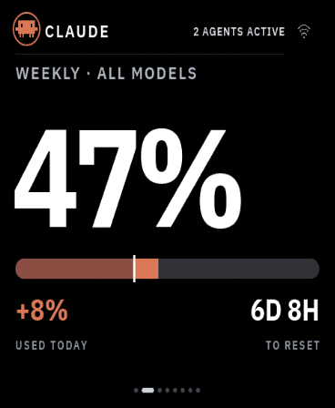

# Install VibePulse on Waveshare ESP32-S3-Touch-AMOLED-1.8 V2

**Supported in current source: V2 only**, portrait **368 × 448**. VibePulse
has been installed and the owner reports the display, touch, settings and
network path working on one real unit. See the [physical review](superpowers/reviews/2026-09-25-waveshare-amoled-18-v2-physical.md)
for the exact evidence and limitations. V1 is not supported. The 1.8-inch
product name covers two incompatible hardware generations.



*Native-size simulator preview with fixture data, not a physical-panel photo
or live account reading. Physical verification is summarized in the
[owner report](superpowers/reviews/2026-09-25-waveshare-amoled-18-v2-physical.md).*

## Identify the exact board

Check the **V2** marking on the back before building. V1 uses SH8601/FT3168;
V2 uses a CO5300 QSPI AMOLED and CST820 capacitive touch. This profile selects
Waveshare's managed BSP 2.0.3. Do not flash a 2.16 or 2.41 image to this board.

The published specs list ESP32-S3R8, 16 MB flash and 8 MB PSRAM. VibePulse
does not enable or claim support for its audio, RTC, IMU, battery/PMU or
microSD parts. See the [hardware registry](../spec/boards/waveshare_18_v2/hardware.md).

[Waveshare product page — affiliate link](https://www.waveshare.com/esp32-s3-touch-amoled-1.8.htm?&aff_id=179337).
Niclas Vestlund may earn a commission from this link. Waveshare supplied
development hardware.

## Build from current source

Use ESP-IDF 5.5.2 and a separate generated SDK configuration for this board.
The default remains `waveshare_216`.

```sh
test -f secrets.h || cp secrets.h.example secrets.h
. ~/esp/esp-idf/export.sh
idf.py -B build-18-v2 \
  -D TORGET_BOARD=waveshare_18_v2 \
  -D SDKCONFIG="$PWD/sdkconfig.waveshare_18_v2" \
  -D TORGET_SOLELKOLLEN_DIR="$PWD/no-companion" reconfigure
cmake --build build-18-v2 --parallel 2
```

The `no-companion` path keeps unrelated local companion projects out of a
VibePulse-only build. Keep this build directory and generated SDK config
separate from other boards. The 368 × 448 panel uses an origin-pivoted LVGL
viewport transform for the shared 480 × 480 composition; the target reserves
a 768 KiB PSRAM-backed LVGL pool for the temporary layer. Runtime high-water
and long-running network stress are not yet measured.

For an optional native preview, use the project's host dependencies and run:

```sh
tools/preview-ui.sh vibepulse waveshare_18_v2
```

## Back up and install over USB

For another unit, identify its serial port and make a private full-flash
backup before replacing firmware. A backup can contain Wi-Fi credentials;
keep it local and restrict access. This port's development unit was explicitly
authorized for flashing without a backup because it held only standard data;
that one-time decision is not a default for other boards.

```sh
python -m serial.tools.list_ports -v
VIBEPULSE_PORT=/dev/cu.usbmodemXXXX # replace with the identified device
mkdir -p backups && chmod 700 backups && umask 077
python -m esptool --chip esp32s3 -p "$VIBEPULSE_PORT" \
  read_flash 0x0 0x1000000 backups/before-18-v2.bin
python -m esptool --chip esp32s3 -p "$VIBEPULSE_PORT" \
  verify_flash 0x0 backups/before-18-v2.bin
idf.py -B build-18-v2 -p "$VIBEPULSE_PORT" flash
```

If automatic download mode does not work, hold **BOOT** while connecting USB,
then release it once connected. **PWR** is not the BOOT button. Keep BOOT
released during normal startup. Let esptool verify every written segment;
the generated `build-18-v2/flash_args` is the source for flash addresses.
Do not erase NVS as a routine recovery step. Updates for this profile use USB;
OTA is not verified.

## Connect Wi-Fi and check the panel

1. On the screen, hold **BOOT** for three seconds, open **SETTINGS → WIFI**,
   then scan the temporary setup QR code. It carries credentials for the
   panel's temporary access point, not for your home network.
2. On iPhone, accept the operating-system prompt to join the temporary
   network. iOS may require you to return to Camera/Safari or open
   `http://192.168.4.1/` manually. The confirmation is an iPhone network
   consent step; the QR code alone cannot skip it.
3. Choose a 2.4 GHz network, enter its password, and leave the local portal
   open while the display connects. Then check the live VibePulse view and
   touch at all four corners.

The owner reports the V2 unit's display, touch, Wi-Fi path and BOOT settings
working. The current iPhone Wi-Fi QR flow is still too many manual steps and
is a known product UX limitation; the [Wi-Fi design notes](wifi.md) describe
the current flow. Network onboarding ergonomics are not an acceptance claim.

## Known boundaries

- Portrait UI is scaled from the shared 480 × 480 design. Audio, RTC, IMU,
  battery/PMU and microSD are not enabled or verified.
- The firmware built successfully with ESP-IDF 5.5.2. Duplicate Kconfig
  symbol warnings from the simultaneously resolved 1.8 and 2.16 BSPs remain.
- The transform's target runtime memory high-water and extended Wi-Fi/TLS
  stress are not measured. No OTA or Windows build claim follows from this
  physical unit.
- See the [porting journal](porting-journal-waveshare-amoled-18-v2.md) for
  build failures, corrections, source revisions and lessons for the next
  display port.
